### 1 Spring整体架构

#### 1.1 Spring的整体架构

### 2. 容器的基本实现

#### 2.2 功能分析

#### 2.4 Spring的结构组成

1. `DefaultListableBeanFactory `spring注册和加载bean的核心实现

   `XmlBeanFactory `使用自定义的xml读取器(`XmlBeanDefinitionReader`)，实现个性化的`BeanDefinitionReader`读取

   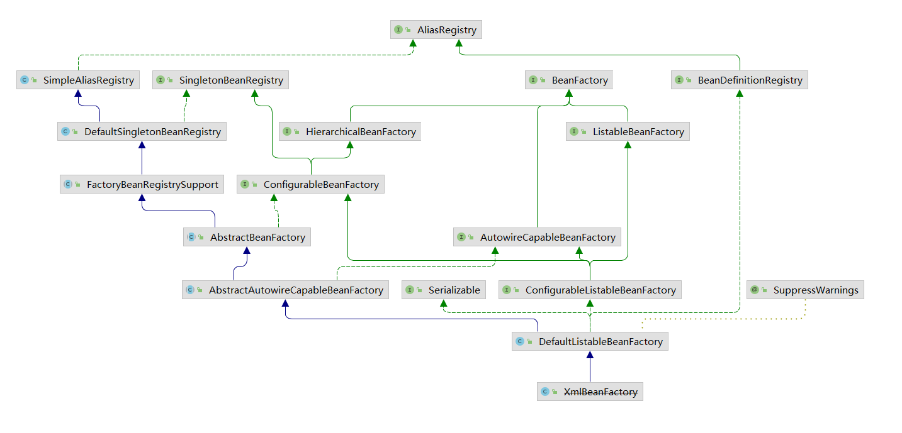

2. `XmlBeanDefinitionReader `完成资源文件的读取解析注册功能

#### 2.5 XmlBeanFactory 容器基础

```java
BeanFactory bf = new XmlBeanFactory(new ClassPathResource("spring-config.xml"));
```

2.5.1 配置文件封装

`ClassPathResource `来读取配置文件 使用`Resource`接口封装底层资源

检测文件的存在性，可读性，是否打开，文件名，不同资源到URL, File类型的转换等

多个实现类：

1. FileSystemResource
2. ClassPathResource
3. UrlResource
4. InputStreamResource
5. ByteArrayResource

```text
Resource 负责完成对配置文件进行封装(ClassPathResource)
配置文件的读取由XmlBeanDefinitionReader处理

AbstractAutowireCapableBeanFactory的构造函数
忽略给定接口的自动装配功能
当A中由B属性，当Spring在获取A的Bean的时候如果B还没初始化，那么Spring会自动初始化B
但是当B实现了某些接口的情况下，B不会被初始化(比如BeanNameAware, BeanFactoryAware, BeanClassLoaderAware)

XmlBeanFactory.loadBeanDefinitions 
1. 封装资源文件 Resource -> EncodedResource(对资源文件进行编码)
2. 获取输入流 InputStream -> InputSource
3. 加载bean doLoadBeanDefinitions
    1. 获取对xml文件的验证模式
    2. 加载xml文件，得到对应的Document
    3. 根据返回的Document注册bean信息
```

#### 2.6 获取xml的验证模式(dtd, xsd)

2.6.1 dtd 和 xsd的区别

1. dtd: document type definition文档定义类型

   应该包括：元素的定义规则，元素间关系的定义规则，元素可使用的属性，可使用的实体或符号规则

2. xsd: xml schema definition 描述xml文档结构

根据xml文件中是否保存`DOCTYPE`字符串来确定是哪一种验证模式(包含就是dtd，不包含就是xsd)

(涉及的类`XmlBeanDefinition`, `XmlValidationModeDetector`)

#### 2.7 获取Document

`DocumentLoader `接口的实现类 `DefaultDocumentLoader `完成

`DocumentBuilderFactory -> DocumentBuilder -> Document`

`EntityResolver `如果项目本身提供一个dtd文件时，可以直接读取

#### 2.8 解析注册BeanDefinitions

将文件转换成`Document`之后，开始提取注册bean `XmlBeanDefinitionReader#registerBeanDefinitions` 

`org.springframework.beans.factory.xml.DefaultBeanDefinitionDocumentReader#doRegisterBeanDefinitions` 先解析bean节点是否定义profile(用来在配置文件中部署不同的配置使用开发环境，生产环境(可以同时定义多个)等)，然后去解析标签

```xml
<!-- 根据环境加载 bean -->
<beans profile="dev">
	<bean id="" class=""/>
</beans>

<!-- web.xml 中配置当前环境 -->
<context-param>
	<param-name>spring.profiles.active</param-name>
    <param-value>dev</param-value>
</context-param>
```


```text
标签分为两种(org.springframework.beans.factory.xml.BeanDefinitionParserDelegate#isDefaultNamespace(org.w3c.dom.Node))：
1. 默认标签 <bean id="user" class="User" />
org.springframework.beans.factory.xml.DefaultBeanDefinitionDocumentReader#parseDefaultElement

2. 自定义标签 <tx:annotation-driven/>
org.springframework.beans.factory.xml.BeanDefinitionParserDelegate#parseCustomElement(org.w3c.dom.Element)

根据命名空间来区分解析(默认的命名空间 "http://www.springframework.org/schema/beans")
```


### 3. 默认标签(import, alias, bean, beans)的解析

**DefaultBeanDefinitionDocumentReader**.parseDefaultElement()

#### 3.1 bean标签解析注册

1. 解析元素：` BeanDefinitionDelegate#parseBeanDefinitionElement` 返回 `BeanDefinitionHolder`(
   包含配置文件中的各种属性` class, name, id, alias`)
2. 如果存在默认标签的子节点下还有自定义属性，继续对自定义标签进行解析
3. 注册`BeanDefinitionHolder` (`org.springframework.beans.factory.support.BeanDefinitionReaderUtils#registerBeanDefinition`)
4. 发出响应事件，通知相关的监听器，说明这个bean已经加载完成了

3.1.1 解析`BeanDefinition`

1. 提取元素中的`id, name`
2. 解析其他属性统一封装到`GenericBeanDefinition`(对象中的`class`, `parent`, 元数据, `lookup-method`, `replaced-method`, 构造函数参数, `property`, `qualifier`等)
3. 如果bean没有名称，就用默认规则生成一个
4. 将获取到的信息封装到`BeanDefinitionHolder`中

`DefaultBeanDefinitionDocumentReader.processBeanDefinition`方法

`BeanDefinition`配置文件<bean>元素标签在容器中的内部表示形式(一一对应)，全部注册到`BeanDefinitionRegistery`

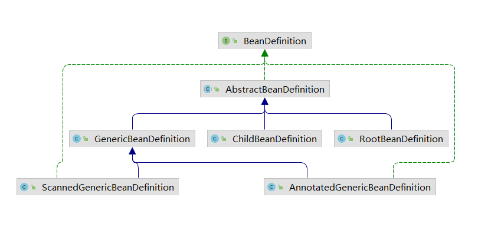

`AnnotatedGenericBeanDefinition`：存储`@Configuration`注解注释的类

`ScannedGenericBeanDefinition`：存储`@Component、@Service、@Controller`等注解注释的类

spring初始化时，会用`GenericBeanDefinition`或是`ConfigurationClassBeanDefinition`
（用@Bean注解注释的类）存储用户自定义的Bean，在初始化Bean时，又会将其转换为`RootBeanDefinition`

`pBeanDefinitionParserDelegate#parseBeanDefinitionElement`

1. 创建用于属性承载的`BeanDefinition`，实际创建的是`GenericBeanDefinition`

   `<bean> -> BeanDefinition(子类) RootBeanDefinition(没有父类，对应<bean>标签)`，最后将`BeanDefinition`注册到`BeanDefinitionRegistry`中

2. 解析各种属性(`parseBeanDefinitionAttributes`)

   解析bean的属性(`scope, lazy-init, autowired, dependncy-check, depends-on, autowired-candidate, primary, init-method, destory-method, factory-method, factory-bean`)

   `org.springframework.beans.factory.xml.BeanDefinitionParserDelegate#parseBeanDefinitionAttributes`

3. 解析子元素meta(`parseMetaElements`)
   ```text
   声明的key不会在bean中体现，需要使用时，通过BeanDefinition.getAttribute(key)来获取
   <bean id="user" class="User">
     <meta key="str" value="aStr"/>
   </bean>
   ```

4. 解析lookup-method(`parseLookupOverrideSubElements`)

   获取器注入：把一个抽象方法声明为返回某种类型的bean，但实际要返回的bean是在配置文件中配置的

   将数据存储到 `LookupOverride `对象中，放到`AbstractBeanDefinition`的`methodOverrides`字段中

5. 解析replaced-method 方法替换：不仅能动态的替换返回的bean，还动态修改原有方法的逻辑(`parseReplacedMethodSubElements`)
   将数据存储到 `LookupOverride `对象中，放到`AbstractBeanDefinition`的`methodOverrides`字段中

6. 解析constructor-arg(`parseConstructorArgElements`)

   解析构造函数中的元素

   - 如果指定了index属性，会把最终解析的信息放到`BeanDefinition`的`constructorArgumentValues`的`indexedArgumentValues`中

   - 如果没有指定index属性，会被放到`genericArgumentValues`中

   构造函数中属性元素的解析过程：

    1. 忽略`description `和 `meta`
    2. 获取`constructor-arg`上的`ref`或`value`(二者只能存在一个)
     3. ref、value 或 子元素(array, set, map, list) 属性处理封装
          1. 使用`RuntimeBeanReference`封装ref名称
          2. 使用`TypeStringValue`封装value

7. 解析子元素 `property`

8. 解析子元素
   
   使用`qualifier `给bean注入其他的bean对象

3.1.2 `AbstractBeanDefinition`

​	`GenericBeanDefinition ` 记录xml中的所有配置

​	`AbstractBeanDefinition` 是父类，记录bean中的大部分通用属性

3.1.3 解析默认标签中的自定义标签元素

​	`decorateBeanDefinitionIfRequired`对`BeanDefinition`进行装饰

​	对于默认标签忽略不处理，只处理自定义标签，根据自定义标签查找命名空间处理器

3.1.4 注册解析的BeanDefinition

`BeanDefinitionReaderUtils.registerBeanDefinition `

- beanName注册：使用`beanName`作为唯一的标识注册，注册到 `ConcurrentHashMap<String, BeanDefinition> beanDefinitionMap`，beanName不允许重复

- 别名注册：`SimpleAliasRegistry.registerAlias`
  1. 如果 alias 与 beanName 相同：不处理并删除alias
  2. alias 覆盖处理
  3. alias 循环检查
  4. 注册 alias

3.1.5 通知监听器解析 注册完成

`org.springframework.beans.factory.xml.DefaultBeanDefinitionDocumentReader.processBeanDefinition getReaderContext().fireComponentRegistered(new BeanComponentDefinition(bdHolder));`
扩展实现，如果需要对注册BeanDefinition事件进行监听时可以通过注册监听器写入处理逻辑

#### 3.2 alias标签解析

`DefaultBeanDefinitionDocumentReader.processAliasRegistration`

`Map<String, String> aliasMap` key是alias, value是beanName

```xml
起别名
<bean id="user" name="aUser, bUser" class="com.spring.learn.bean.User" />
或
<bean id="user" class="com.spring.learn.bean.User" />
<alias name="user" alias="aUser, bUser" />
```

#### 3.3 import标签解析

`DefaultBeanDefinitionDocumentReader.importBeanDefinitionResource`

1. 获取`resource`属性表示的路径
2. 解析路径中的系统属性 (`${user.dir}`)
3. 判断`location`是相对路径还是绝对路径
4. 如果是绝对路径递归调用bean的解析过程
5. 如果是相对路径计算出绝对路径进行解析
6. 通知监听器，完成解析

```xml
导入其他的配置文件
<beans>
  <import resource="service.xml" />
<beans>
```

#### 3.4 beans标签解析

​	递归调用beans标签的解析过程

### 4. 自定义标签的解析

`BeanDefinitionParserDelegate.parseCustomElement(org.w3c.dom.Element)`

#### 4.1 自定义标签的使用

- 自定义xsd文件描述组件内容
- 创建类实现`BeanDefinitionParser`用来解析xsd文件的定义和组件定义
- 创建类实现`NamespacehandlerSuppport`，将组件注册到spring容器
- 编写`spring.handlers, spring.schemas`放到`META-INF`文件夹下面

加载自定义标签的流程：

遇到自定义标签之后去`spring.handlers`和`spring.schemas`中找对应的handler和xsd，默认位置是META-INF，找到对应的handler和解析元素的Parser，完成自定义元素的解析spring将自定义标签的解析工资委托给用户实现

#### 4.2 自定义标签解析

- 获取对应的命名空间：w3c提供命名空间的获取

- 根据命名空间找到对应的`NamespaceHandler`进行解析`DefaultNamespaceHandlerResolver#resolve`

  获取所有已经配置的handler映射(`DefaultNamespaceHandlerResolver#getHandlerMappings`)

  根据命名空间找到对应的信息

  - 如果已做过解析直接从缓存中读取
  - 没有做过解析返回的时类路径，用反射将类路径转换成类，初始化类，调用init方法初始化对象，记录到缓存中

- 调用自定义的`NamespaceHandlerSupport#parse`进行解析

  - 寻找解析器

    获取元素名称(`<myname:user ...>`的名称是user)，找到解析器(在自定义的类中已经进行了注册)

  - 解析操作

    解析标签(`AbstractSingleBeanDefinitionParser#parseInternal`)，处理`beanClass, scope, lazyInit`等，然后调用用户自己定义的parse方法，最后将解析好的`AnstractBeanDefinition`转换成`BeanDefinitionHolder`


### 5. bean的加载

1. beanName转换(别名的情况，FactoryBean 的情况)
2. 尝试从缓存中加载实例
3. bean的实例化(处理工厂bean等)
4. 原型模式的依赖检查(只有单例情况下会产生解决循环依赖)
5. 检测parentBeanFactory(如果缓存中没有数据直接转到父类工厂上加载)
6. 将存储xml配置的GenericBeanDefinition转换成RootBeanDefinition
7. 寻找该bean中存在的依赖
8. 针对不同的scope进行bean的创建
9. 类型转换

#### 5.1 FactoryBean

该接口用来定制实例化bean，`org.springframework.beans.factory.FactoryBean<T>` 有三个方法

1. `getObject `: 返回`FactoryBean`创建的bean实例对象，如果`isSingleton`返回true，该对象也会被放到容器的单例缓存池中
2. `getObjectType `: 返回创建的bean类型
3. `isSingleton `: bean的作用域

如果配置文件中`<bean>`的`class`是`FactoryBean`的实现类，通过`getBean`返回的不是`FactoryBean`本身，而是`getObject`方法返回的对象；如果要获取`FactoryBean`实例，需要在id前加上&前缀(`getBean("&car")`)

#### 5.2 缓存中获取单例bean

`DefaultSingletonBeanRegistry.getSingleton(String)`

`getBean`方法会首先尝试从缓存中加载，然后尝试从`singletonFactories`中加载

为了避免循环依赖，在创建`bean`的过程中不会等`bean`创建完成就会将创建`bean`的`ObjectFactory`提前加入到缓存中，如果下一个`bean`需要上一个`bean`，就直接使用`ObjectFactory`

```text
1. Map<String, Object> singletonObjects: 存储 beanName 和 bean实例 的关系
2. Map<String, ObjectFactory<?>> singletonFactories： 存储 beanName 和 创建bean的工厂 的关系
3. Map<String, Object> earlySingletonObjects: 存储 beanName 和 bean实例 的关系，bean放入之后，即使还在创建过程中，也可以通过getBean获取，用来检测循环依赖  
4. Set<String> registeredSingletons: 存储当前所有已注册的bean，LinkedHashSet有序的
```

首先从1中获取，获取不到就去3中获取，还获取不到就去2中获取工厂创建对象，同时从2中移除工厂对象并且放到3中

#### 5.3 从bean实例中获取对象

1. `AbstractBeanFactory.getObjectForBeanInstance` 

2. `org.springframework.beans.factory.support.FactoryBeanRegistrySupport#getObjectFromFactoryBean` 

3. `org.springframework.beans.factory.support.FactoryBeanRegistrySupport#doGetObjectFromFactoryBean` 

4.  `factory.getObject() `  从 FactoryBean 中拿到真实对象
5. `org.springframework.beans.factory.support.FactoryBeanRegistrySupport#postProcessObjectFromFactoryBean`  调用后置处理器 BeanPostProcessor

检测bean的正确性(如果是`FactoryBean`则调用`getObject`，否则直接返回对象)

拿到bean之后调用注册的`BeanPostProcessor`的`postProcessAfterInitialization`方法(`AbstractAutowireCapableBeanFactory#postProcessObjectFromFactoryBean`)

#### 5.4 获取单例

`DefaultSingletonBeanRegistry.getSingleton(String, ObjectFactory<?>)`
如果缓存中没有拿到，从头开始创建对象(`getSingleton`整个过程需要同步)

该方法会在创建`bean(singletonFactory.getObject)`前后执行一些操作(`beforeSingletonCreation`, `afterSingletonCreation`)

1. 检查缓存是否已经加载过

2. 如果没有加载，记录`beanName`的正在加载状态

3. 加载单例前记录加载状态(`beforeSingletonCreation `将当前正要创建的bean记录到缓存中，便于循环依赖检测)

4. 使用`ObjectFactory`实例化`bean`(`getObject`)

5. 加载后调用处理方法(`afterSingletonCreation `移除bean的加载状态)

6. 将bean放入缓存并清除bean加载过程中的各种辅助状态(就是清理上面的几个Map)

7. 返回结果

   ```java
   // 第二个参数 ObjectFactory，每个 bean 创建过程中都会有一个
   sharedInstance = getSingleton(beanName, () -> {
   	try {
   		return createBean(beanName, mbd, args);
   	}
   	catch (BeansException ex) {
   		// Explicitly remove instance from singleton cache: It might have been put there
   		// eagerly by the creation process, to allow for circular reference resolution.
   		// Also remove any beans that received a temporary reference to the bean.
   		destroySingleton(beanName);
   		throw ex;
   	}
   });
   ```

   

#### 5.5 创建bean

```text
org/springframework/beans/factory/support/AbstractBeanFactory.java:332
AbstractAutowireCapableBeanFactory#createBean()

do* 完成真正的逻辑
get* create* 完成一些统筹工作
```

**createBean**

1. 根据设置的`class`属性或`className`来解析`Class`
2. 对`override`属性进行标记验证(`lookup-method`, `replace-method`两个配置存放在`BeanDefinition`的`methodOverrides`字段)
3. 应用初始化前的后置处理器，解析指定bean是否存在初始化前的短路操作
4. 创建bean

处理`override`属性

```text
org.springframework.beans.factory.support.AbstractBeanDefinition.prepareMethodOverrides

lookup-method, replace-method 两个配置会统一存放在BeanDefinition的methodOverrides属性中
在bean实例化过程中，如果检测到存在methodOverrides属性，会动态为当前bean生成代理并使用对于的拦截器做增强处理
这里会简单判断一下是否有重载方法 (getMethodCountForName)

<!-- getBean是一个需要返回bean的抽象方法，具体返回什么在配置文件中配置	-->
<lookup-method name="getBean" bean="teacher"/>

<!-- 实现MethodReplacer接口，替换原有的方法-->
<replaced-method name="changeMe" replacer="replacer">
    <!-- 如果有重载方法，可以配置多个参数类型-->
    <!-- <arg-type>String</arg-type>-->
</replaced-method>
```

实例化的前置处理

`AbstractAutowireCapableBeanFactory#resolveBeforeInstantiation`

如果前置处理返回的结果不为空，会直接返回bean结果，不进行后续创建(aop功能基于这里判断)
对后置处理器中的所有`InstantiationAwareBeanPostProcessor`类型进行两个方法调用

1. 实例化前的后处理应用

   `postProcessBeforeInstantiation`改方法调用之后，返回的bean可能是经过代理的对象(cglib, jdk)

2. 实例化后的后处理应用

   `postProcessAfterInitialization`如果上面的bean不为空，就不会进行后面普通bean的创建过程，所以需要在这里调用后置处理方法

```text
先执行: 
InstantiationAwareBeanPostProcessor extends BeanPostProcessor添加了两个方法
	postProcessBeforeInstantiation 实例化前调用
	postProcessAfterInstantiation 实例化后调用 (应用所有的 BeanPostProcessor#postProcessAfterInitialization 方法)

后执行
BeanPostProcessor接口两个方法
    postProcessBeforeInitialization 初始化前调用提供一个修改BeanDefinition的机会(调用改方法后，bean可能会被改变(代理bean))
    postProcessAfterInitialization bean初始化后调用
```

#### 5.6 循环依赖

spring容器将每一个正在创建的bean标识符放在一个容器中，如果在创建过程中发现自己已经在容器中了，会抛出异常；创建完成后从容器中清除掉

1. 构造器循环依赖

   通过构造器注入造成的循环依赖，是**无法解决**的(`BeanCurrentlyInCreationException`)

2. setter循环依赖

   通过Spring容器**提前暴露**刚完成构造器注入但未完成其他步骤(如 setter 注入)的bean完成的，提前暴露一个单例工厂方法(`ObjectFactory`)，使其他bean能引用到它

3. prototype的依赖处理

   **无法解决**，因为容器不缓存作用域为`prototype`的bean

#### 5.7 创建bean

**创建Bean实例**

`resolveBeforeInstantiation`之后，如果 `postProcessorInstantiation`方法返回了bean就直接返回

否则开始创建`AbstractAutowireCapableBeanFactory.doCreateBean`

1. 如果是单例，清除缓存

2. 实例化bean，将`BeanDefinition`转换成`BeanWrapper`

   - `createBeanInstance `根据只当bean使用对应的策略创建新的实例

   - 如果存在工厂方法就是要工厂方法进行初始化

   - 如果有多个构造函数，就根据参数查找对应的构造函数进行初始化

   - 否则采用默认的构造函数进行实例化

3. `MergeBeanDefinitionPostProcessor`应用

   bean合并后的处理(`@Autowired`注解通过此方法实现类型的预解析)

4. 依赖处理：如果AB有循环依赖，会通过放入缓存中的ObjectFactory来创建实例，解决循环依赖问题

5. 属性填充：将所有属性填充到bean对象中

6. 循环依赖检查

   判断已加载的bean是否已经出现循环依赖，判断是否需要抛出异常；对于prototype作用域的bean，只能抛出异常`BeanCurrentlyInCreationException`

7. 注册`DisposableBean`：如果配置了`destroy-method`，需要注册便于销毁时调用

8. 完成创建并返回

**创建bean实例**`AbstractAutowireCapableBeanFactory#doCreateBean`，具体过程如下：

`AbstractAutowireCapableBeanFactory#createBeanInstance`

1. 如果`RootBeanDefinition`中存在`factoryMethodName`属性(配置文件中配置了`factory-method`)，会尝试用工厂方法生成bean

    `org.springframework.beans.factory.support.AbstractAutowireCapableBeanFactory#instantiateUsingFactoryMethod`

2. 解析构造函数进行实例化；由于可能存在多个构造函数，参数不同，根据参数类型判断使用哪个进行实例化；由于解析过程比较消耗性能，因此采用缓存，将已解析过的对象放到`RootBeanDefinition`中的`resolvedConstructorOrFactoryMethod`字段

    1. `autowireConstructor `带参数的实例化(`ConstructorResolver.autowireConstructor`)

       - 确定构造函数的参数

         - 根据`explicitArgs`参数判断 `getBean(beanName, ...args)` 这种方式获取bean时参数已经确定了

         - 如果已经分析过就从缓存中获取(拿到的是初始类型，可能需要转换 "1" -> 1)

         - 从配置文件中获取(可能是指定值，也可能是其他bean的引用(`resolveConstructorArguments`处理))

       - 确定构造函数

         根据参数个数匹配

         有两种情况(index, name)，所以需要先获取参数名称

         ​	`<constructor-arg index="0" value="name"/>`

         ​	`<constructor-arg name="password" value="password"/>`

       - 根据确定的构造函数转换对应的参数类型

       - 构造函数的不确定性验证

       - 实例化bean

    2. `AbstractAutowireCapableBeanFactory#instantiateBean `无参构造函数的实例化

        ​	直接实例化bean

    3. 实例化过程

       `SimpleInstantiationStrategy.instantiate(RootBeanDefinition, String beanName, BeanFactory)`

        1. 如果没有使用 `replace `和 `lookup `方法，直接用反射创建对象
        2. 如果使用了，使用`cglib`动态代理的方式将包含两个特性对应的逻辑设置进去

**记录创建bean的ObjectFactory**

`earlySingletonExposure` 单例 + 允许循环依赖 + 正在创建 同时满足才会记录`ObjectFactory`

循环依赖处理：先创建A，在填充属性(`populateBean`)的时候发现依赖B，去创建B同时通过`ObjectFactory`提供的实例化方法中断A的属性填充，B中持有的A仅仅是刚初始化没有填充属性的A(`SmartInstantiationAwareBeanPostProcessor`)，而这正初始化A的步骤还是在最开始创建A的时候进行的，但是因为A与B中的A所表示的属性地址是一样的，所以在A中创建好的属性填充自然可以通过B中的A获取，这样就解决了循环依赖的问题。

**属性注入**

`AbstractAutowireCapableBeanFactory#populateBean 601`

1. `InstantiationAwareBeanPostProcessor` 处理器的 `postProcessAfterInstantiation` 函数控制是否继续进行属性填充

   ```
   BeanPostProcessor 是 postProcessBeforeInitialization 初始化
   InstantiationAwareBeanPostProcessor 添加了 postProcessAfterInstantiation 实例化
   ```

2. 根据注入类型(名称/类型)，提取依赖的bean，统一放入`PropertyValues`

   - autowireByName

     查找`BeanWrapper`中需要依赖注入的属性，遍历用`getBean`方法获取(可能是开始初始化也可能是已经创建好了直接获取)，放入到`PropertiesValues`中

   - autowireByType

     `AbstractAutowireCapableBeanFactory.autowireByType`

     查找`BeanWrapper`中需要依赖注入的属性，根据类型查找匹配的bean ;由于Spring中支持集合类型(`List<XxxBean>`)的注入，Spring会将所有类型匹配的对象找出来(`DefaultListableBeanFactory.resolveDependency`)注入到一个Set(`autowiredBeanNames`)

     先处理`@Value`注解，然后考虑数组类型，`Collection`类型，Map类型

     - 首先获取数组或集合的真实类型` Class.getComponentType (String[] -> java.lang.String)`

     - 查找对应类型的bean，返回一个`Map<beanName, Bean>`

     - 如果`required=true`但是没找到，抛出异常(`NoSuchBeanDefinitionException`)

     - 通过转换器将bean的值转换成对应的类型(`Map, List, Set...`)

3. 应用`InstantiationAwareBeanPostProcessor`的`postProcessPropertyValues`方法，对属性获取完毕填充前对属性再次处理
   例如 `RequiredAnnotationBeanPostProcessor`类中对属性的验证

4. 将获取到的属性(PropertyValues)填充到BeanWrapper
   `applyPropertyValues`

       `MutablePropertyValues mpvs = (MutablePropertyValues) PropertyValues pvs`
       1. 尝试转换(instanceof)PropertyValues -> MutablePropertyValues  
            如果mpvs中的值已经被转换为对应的类型那么可以直接设置到BeanWrapper中
       2. 如果pvs无法不是MutablePropertyValues，直接使用原始的属性获取方法  
       3. 获取对应的解析器，遍历属性转换成对应的类型  

**初始化Bean**

完成bean的实例化，并进行属性填充后，开始调用`init-method`方法进行初始化

`AbstractAutowireCapableBeanFactory.initializeBean(beanName, Bean, RootBeanDefinition)` 改方法的做作用

1. 激活Aware接口(`BeanFactoryAware, ApplicationContextAware, ResourceLoaderAware, ServletContextAware, BeanNameAware, BeanClassLoaderAware`等 )

2. 执行 `BeanPostProcessor `的 `postProcessorBeforeInitialization `方法
3. 调用实现`InitializingBean`接口的`afterPropertiesSet`，然后调用用户自定义的`init-method`方法，
4. 调用 `BeanPostProcessor `的 `postProcessorAfterInitialization `方法

**注册DisposableBean**

销毁方法的扩展入口 `AbstractBeanFactory.registerDisposableBeanIfNecessary`
配置属性`destroy-method` 或实现 `DestructionAwareBeanPostProcessor`接口

### 6. 容器的功能扩展

两种方式加载配置文件

```text
BeanFactory bf = new XmlBeanFactory(new CLassPathResource("bean-factory.xml"));

可以传递多个文件路径，解析功能在 refresh() 方法中
ApplicationContext ac = new ClassPathXmlApplicationContext("bean-factory.xml", "bean-factory-2.xml");
```

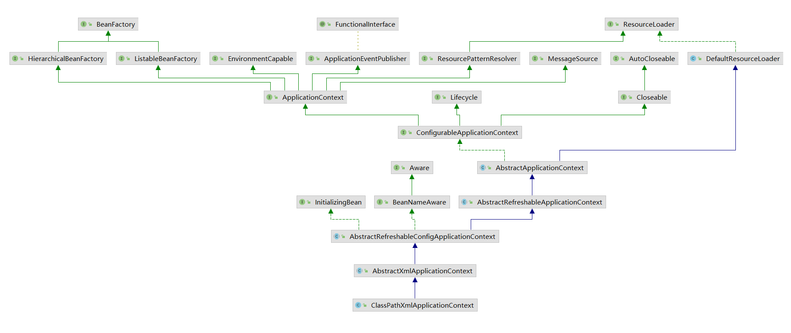

#### 6.1 设置配置路径

​		解析给定的一个或多个配置文件路径，如果给的路径数组中包含特殊符号(比如`${var}`)，会搜索系统变量进行替换

#### 6.2 扩展功能

配置文件的解析`AbstractApplicationContext.refresh`

1. 初始化准备(对系统属性 或 环境变量进行准备验证)

2. 初始化`BeanFactory`，读取xml文件

   该操作完成后，已经包含`BeanFactory`提供的所有功能

3. 对`BeanFactory`进行各种功能填充

   `@Qualifier @Autowired`

4. 扩展：子类覆盖方法做额外处理

5. 激活`BeanFactory`处理器

6. 注册拦截bean创建的bean处理器，只是注册，`getBean`的时候调用

7. 为上下文初始化`Message`源，对不同语言的消息进行国际化处理

8. 初始化应用消息广播器，放入`applicationEventMulticaster`这个bean中

9. 扩展：子类初始化其他bean

10. 查找`listener `注册到广播器中

11. 初始化剩下的单实例(`non-lazy-init`)

12. 完成刷新过程，同时生命周期处理器`lifecycleProcessor`刷新过程，同时发出`ContextRefreshEvent`通知

如果过程中出现异常：销毁创建好的bean对象，取消刷新

#### 6.3 环境准备

`prepareRefresh`对系统属性 和 环境变量 的初始化验证

#### 6.4 加载BeanFactory

`AbstractApplicationContext#refresh -> obtainFreshBeanFactory`

委托给 `AbstractRefreshableApplicationContext.refreshBeanFactory`
该方法完成后，`ApplicationContext `会包含 `BeanFactory `的所有功能

1. 创建 `DefaultListableBeanFactory beanFactory `(`XmlBeanFactory `也继承该类)
2. 指定`beanFactory`序列化id
3. 定制 `BeanFactory`
4. 加载 `BeanDefinition`
5. 用全局变量记录`beanFactory`

**定制BeanFactory** `customizeBeanFactory`

增加是否允许覆盖同名称不同定义的对象，是否允许bean之间循环依赖

以上两项需要在子类中设置(`com.spring.learn.context.MyApplicationContext.customizeBeanFactory`)

并提供了 `@Qualifier` 和 `@Autowired` 支持

`autowireByType `默认会使用`Spring`提供的`SimpleAutowireCandidateResolver`

设置`QualifierAnnotationAutowireCandidateResolver`支持使用注解方式的注入bean

**加载BeanDefinition**

`AbstractXmlApplicationContext.loadBeanDefinitions(DefaultListableBeanFactory)`

初始化`beanFactory(DefaultListableBeanFactory)`

创建一个`XmlBeanDefinitionReader(beanFactory)`用来读取xml文件 ，设置一些环境变量，也允许子类初始化

创建完以上两个对象后，开始读取配置文件，完成后`beanFactory`中包含所有解析好的配置


#### 6.5 功能扩展

`AbstractApplicationContext#refresh -> prepareBeanFactory`

1. 增加对SpEL语言的支持
2. 增加对属性编辑器的支持
3. 增加对一些内置类的信息注入(比如：`EnvironmentAware`, `MessageSourceAware`)
4. 设置依赖功可忽略的接口
5. 注册一些固定依赖的属性
6. 增加`AspectJ`的支持
7. 将环境变量及属性注册以单例模式注册

**增加SpEL语言的支持**

SpEL(`Spring Expression Language` `#{...}`)：用来在运行时构建复杂表达式，存取对象图属性，对象方法调用，配置bean定义

只依赖于`spring-core`模块，可单独使用

`beanFactory.setBeanExpressionResolver(new StandardBeanExpressionResolver(beanFactory.getBeanClassLoader()));`注册语言解析器

Spring在bean初始化时会有属性填充，通过调用`AbstractAutowireCapableBeanFactory#applyPropertyValues `完成

- 通过`BeanDefinitionValueResolver`完成属性值的解析功能

- 通过`AbstractBeanFactory#evaluateBeanDefinitionString`完成spel的解析

应用语言解析器主要在**解析依赖注入**bean的时候 和 完成bean的初始化后进行**属性填充**获取

**增加属性注册编辑器**

`addPropertyEditorRegistrar`xml中注入一些其他属性，比如`Date`

两种属性编辑器

1. 使用自定义属性编辑器(继承`PropertyEditorSupport`)

   将属性编辑器注入`CustomeEditorConfigurer.customEditors`

2. 使用Spring自带的属性编辑器(实现`PropertyEditorRegistrar`接口，重新`registerCustomEditors`方法)

   将属性编辑器注入`CustomEditorConfigurer.propertyEditorRegistrars`字段中

`ResourceEditorRegistrar.registerCustomEditors`该方法注册了一系列常用类型的属性编辑器

比如Class 如果某个bean中存在Class类型的属性，Spring中会调用ClassEditor将配置中定义的String类型转换成Class类型进行赋值

`beanFactory.addPropertyEditorRegistrar(new ResourceEditorRegistrar(this, getEnvironment()));`

`ResourceEditorRegistrar`实现批量注册功能，这里添加进去

`AbstractBeanFactory.registerCustomEditors` 方法中注册进去

`AbstractBeanFactory.initBeanWrapper `方法调用注册(该方法将`BeanDefinition`转换为`BeanWrapper`后用于属性填充)

```text
bean的初始化后会调用ResourceEditorRegistrar.registerCustomEditors方法进行批量的通用属性编辑器注册
注册后，在属性填充时spring可以直接使用编辑器进行属性的解析
```

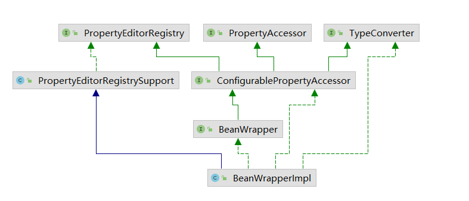

`org.springframework.beans.PropertyEditorRegistrySupport.createDefaultEditors` 定义了一些基础类的转换

**添加ApplicationContextAwareProcessor 处理器**

`AbstractApplicationContext`
`beanFactory.addBeanPostProcessor(new ApplicationContextAwareProcessor(this));`

```text
在bean实例化时，当spring激活init-method方法前后，会调用BeanPostProcessor的两个方法  
```

`ApplicationContextAwareProcessor`该接口的`postProcessBeforeInitialization`方法中，实现一些Aware接口的bean在被初始化后可以获取一些资源(以下接口这时已经被调用了)

```text
主要设置以下的Aware接口
EnvironmentAware, EmbeddedValueResolverAware, ResourceLoaderAware, ApplicationEventPublisherAware, 
MessageSourceAware, ApplicationStartupAware, ApplicationContextAware
```

**设置忽略依赖**

上面的`ApplicationContextAwareProcessor`注册以后，一些属性已经填充了(上面的七个)

需要在spring做bean的依赖注入的时候忽略掉`ignoreDependencyInterface`

**注册依赖**

有忽略的依赖，也有注册进去的依赖`registerResolvableDependency`

```text
BeanFactory, ResourceLoader, ApplicationEventPublisher, ApplicationContext
```

注册了依赖解析之后，比如`BeanFactory`，bean属性注册的时候如果检测到属性类型为`BeanFactory`，就会将`beanFactory`实例注册进去

#### 6.6 BeanFactory的后处理

`postProcessBeanFactory`

`BeanFactory`存放所有已加载的bean，为了保证程序的可扩展性，spring对`BeanFactory`做了大量扩展(`PostProcessor`)

**激活注册的BeanFactoryPostProcessor**

只有一个方法`postProcessBeanFactory`

```text
BeanFactoryPostProcessor的作用:
 与BeanPostProcessor类似用来对bean的定义进行处理，在bean的实例化之前读取配置元数据
 可以实现Order接口控制多个的顺序  
 作用域是容器级的  
 
 BeanFactoryPostProcessor在bean实例化之前执行，之后实例化bean（调用构造函数，并调用set方法注入属性值）， 然后在调用两个初始化方法前后，执行了BeanPostProcessor。
 初始化方法的执行顺序是，先执行afterPropertiesSet，再执行init-method。
```

1. 典型应用 **PropertyPlaceholderConfigurer**

用来读取配置文件中的值，用`${}`设置到bean中

该类实现了`BeanFactoryPostProcessor`接口，当spring加载实现了这个接口的bean的配置时，会在bean工厂**载入所有bean的配置之后**执行里面的`postProcessBeanFactory`方法

- 得到配置
- 将得到的配置转换成合适的类型
- 将配置告诉`BeanFactory`，

所以`BeanFactory`会在实例化任何bean之前获得配置信息，去解析文件中的引用

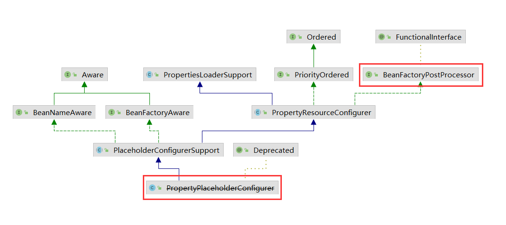

2. 自定义`BeanFactoryPostProcessor`去除一些bean中的属性值

3. 激活`BeanFactoryPostProcessor`

`AbstractApplicationContext.invokeBeanFactoryPostProcessors -> PostProcessorRegistrationDelegate.invokeBeanFactoryPostProcessors`

对于`BeanFactoryPostProcessor`的处理分为两种情况

- `BeanDefinitionRegistry`类的特殊处理
- 普通`BeanFactoryPostProcessor`的处理 

两者都要考虑 硬编码注入 和 配置注入 两种情况，处理过程如下

1. `BeanDefinitionRegistry `硬编码的处理器 添加到`AbstractApplicationContext#beanFactoryPostProcessors`中，其中 `BeanDefinitionRegistryPostProcessor` 继承自 `BeanFactoryPostProcessor`，还有自己定义的方法，因此需要从上面的`beanFactoryPostProcessors`中选出来，调用``postProcessBeanDefinitionRegistry` 方法

2. 记录后置处理器的List

    - registryPostProcessors 记录通过硬编码注册的 `BeanDefinitionRegistryPostProcessor`

    - regularPostProcessors 记录通过硬编码注册的 `BeanFactoryPostProcessor`

    - registryPostProcessorBeans 记录通过配置方式注册的 `BeanDefinitionRegistryPostProcessor`

3. 对上面三个List里面的所有后置处理器统一调用 `postProcessBeanFactory`

4. 对`beanFactoryPostProcessors`中的非`BeanDefinitionRegistryPostProcessor`调用 `postProcessBeabFactory`

5. 普通beanFactory处理


**注册BeanPostProcessor**

`AbstractApplicationContext#registerBeanPostProcessors`

`BeanFactory`中没有实现后处理器的自动注册，`ApplicationContext`中添加了自动注册功能

1. 区分实现了`PriorityOrdered`, `Ordered`接口的`BeanPostProcessor` 和 普通的 `BeanPostProcessor`
2. 依次注册`PriorityOrdered`, `Ordered`, `Other`, `MergedBeanDefinitionPostProcessor` 四种
3. 创建添加一个`ApplicationListenerDetector`

这里会保证注册的`beanPostProcessor`的唯一性

**初始化消息资源**

`initMessageSource`

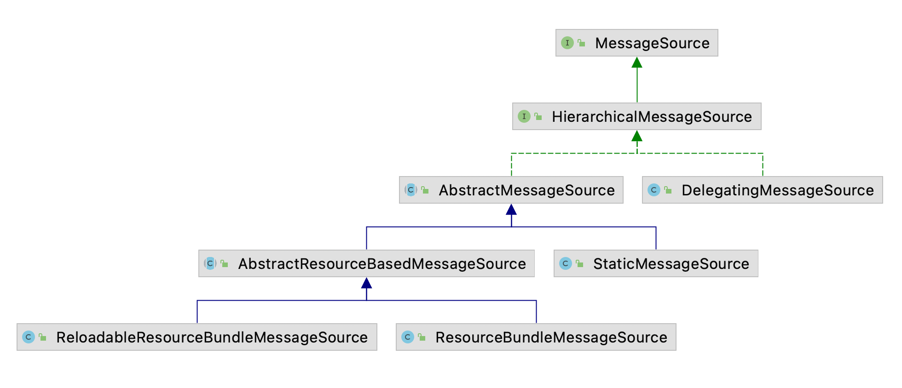

基于`java.util.ResourceBundle`实现

1. `ReloadableResourceBundleMessageSource `提供定时刷新功能(在不重启的情况下，更新资源信息)
2. `StaticMessageSource `用于测试
3. `DelegatingMessageSource `方便操作父类`MessageSource`提供的代理类

`AbstractApplicationContext#initMessageSource`该方法主要功能时提取配置中定义的`messageSource`，记录在spring容器(`AbstractApplicationContext`)中

如果用户未设置资源文件，spring会提供默认的配置`DelegatingMessageSource`
`this.messageSource = beanFactory.getBean(MESSAGE_SOURCE_BEAN_NAME, MessageSource.class);`

用硬编码的方式规定了 `id='messageSource'`，否则找不到自定义资源配置；找到以后将自定义资源文件配置记录在容器中

**初始化ApplicationEventMulticaster**

`AbstractApplicationContext#initApplicationEventMulticaster`

事件广播器(观察者)

1. 如果用户自定义了事件广播器，使用用户自定义的
2. 如果用户没有自定义，使用默认的`ApplicationEventMulticaster`

广播器用于存放监听器并在合适的时候调用监听器

产生事件之后，如果使用默认的广播器，会遍历所有的监听器，使用 onApplicationEvent 方法处理

**注册监听器**

`AbstractApplicationContext#registerListeners`

查找硬编码 和 配置文件 两种方法注册的监听器添加到广播器中


#### 6.7 初始化非延迟加载单例

`AbstractApplicationContext#finishBeanFactoryInitialization`

完成BeanFactory的初始化工作

- ConversionService的设置
- 配置冻结
- 非延迟加载的bean的初始化工作

**ConversionService的设置**

1. `ConversionService `设置：注册一些类型转换器(`Converter<String, Date>`)
2. 冻结配置：冻结bean的定义(`freezeConfiguration`)，注册的bean不允许再被修改
3. 初始化非延迟加载：`DefaultListableBeanFactory#preInstantiateSingletons`   `ApplicationContext`默认在启动时实例化所有单例bean(就是调用`getBean(beanName)`方法)

#### 6.8 finishRefresh

`AbstractApplicationContext#finishRefresh`

spring提供`Lifecycle`接口，保证启动的时候调用start方法开始生命周期，关闭时调用stop结束生命周期(用来配置一些程序，在启动后一直运行(轮询))

1. initLifecycleProcessor：`ApplicationContext`启动或停止时，会通过`LifecycleProcessor`来与所有声明的bean的周期做状态更新，首先进行初始化
2. onRefresh：启动所有实现了`Lifecycle`接口的bean
3. publishEvent：完成`ApplicationContext`初始化之后，发布`ContextRefreshEvent`事件，监听器可以做一些逻辑处理

### 7. AOP

#### 7.1 使用实例

`<aop:aspectj-autoproxy />`

`@EnableAspectJAutoProxy`

#### 7.2 动态aop自定义标签

配置文件中加上`<aop:aspectj-autoproxy />`标签

`AopNamespaceHandler`对该上述标签注册解析器`AspectJAutoProxyBeanDefinitionParser`

**注册AspectJAutoProxyBeanDefinitionParser**

所有的解析器，都是对`BeanDefinitionParser`接口的实现，`parse`函数开始解析

1. 注册或升级`AopNamespaceUtils.registerAspectJAnnotationAutoProxyCreatorIfNecessary`
   
   spring自动注册`AnnotationAutoProxyCreator`，会根据`@Point`注解定义的切点自动代理相匹配的bean
   
   如果已存在自动代理创建器 并且 和现在的不一致，需要根据优先级判断使用哪一个
   
2. 处理 `proxy-target-class` 和 `expose-proxy` 属性

   `proxy-target-class`: spring会使用 jdk动态代理 和 cglib动态代理 为目标对象创建代理对象

    - 如果目标对象至少实现一个接口，会用jdk动态代理(在运行期间创建一个接口的实现类完成代理功能)
    - 如果没有实现接口，会用cglib创建代理对象(使用继承，无法通知final修饰的方法，需要放入cglib对应的jar)

   `expose-proxy` 处理子调用的失效问题 处理方法

     - `expose-proxy=true`
     - `this.b() -> ((AService)AopContext.currentProxy()).b()`
       
       ```java
       public interface AService() {
       	void a();
       	void b();
       }
       
       @Service
       public class AServiceImpl implements AService {
       	@Transactional(propagation=Propagation.REQUIRED)
       	public void a() {
       		this.b(); // 这个this指向的时目标对象，这里的b事务会失效
       	}
       	@Transactional(propagation=Propagation.REQUIRED)
       	public void b() {
       	}
       }

3. 注册组件并通知，便于监听器进一步处理

#### 7.3 创建aop代理

`AnnotationAwareAspectJAutoProxyCreator`

`AbstractAutoProxyCreator.postProcessAfterInitialization`

该类实现`BeanPostProcessor`接口，当spring加载这个bean时，会在实例化前调用`postProcessAfterInitialization`方法(在父类`AbstractAutoProxyCreator`中)

真正创建代理(`AbstractAdvisorAutoProxyCreator.getAdvicesAndAdvisorsForBean`)

获取普通bean的增强方法：

 - 获取所有的增强(`findCandidateAdvisors`)

 - 查找所有增强中适用于bean的增强并应用(`findAdvisorsThatCanApply`)

如果找不到返回null

**获取增强器**

`AnnotationAwareAspectJAutoProxyCreator.findCandidateAdvisors`该类也继承了`AbstractAdvisorAutoProxyCreator`

该类有父类获取**配置文件**中定义的增强 和 获取bean的**注解**增强

- 调用父类的方法加载xml配置文件中的aop声明(`super.findCandidateAdvisors`)

- 调用本类方法加载bean的增强注解(`buildAspectJAdvisors`)

`BeanFactoryAspectJAdvisorsBuilder.buildAspectJAdvisors`

1. 获取所有的`beanName`(所有`beanFactory`中注册的bean)
2. 遍历`beanName`， 找出声明`@AspectJ`的类
3. 对找出来的类进行增强器提取
   `ReflectiveAspectJAdvisorFactory.getAdvisors`
   
    1. 获取普通增强器
        - 对切点注解信息的获取(`ReflectiveAspectJAdvisorFactory.getPointcut`)
          
          主要搜索以下注解`Pointcut.class, Around.class, Before.class, After.class, AfterReturning.class, AfterThrowing.class`
          
        - 根据切点信息生成增强器(`ReflectiveAspectJAdvisorFactory#getAdvisor返回增强器`)
          
          所有的增强都由Advisor的实现类`InstantiationModelAwarePointcutAdvisorImpl`封装(`ReflectiveAspectJAdvisorFactory`)
          
          同时完成增强器的初始化，`@Before @After`等增强位置不同，`instantiateAdvice`创建不同的增强器(`ReflectiveAspectJAdvisorFactory.getAdvice`)
          (`AspectJAroundAdvice, AspectJMethodBeforeAdvice, AspectJAfterAdvice, AspectJAfterReturningAdvice, AspectJAfterThrowingAdvice`)
          
          实现逻辑 `MethodBeforeAdviceInterceptor`
          
          `AbstractAspectJAdvice.invokeAdviceMethodWithGivenArgs`
          前置增强：在拦截器链中放置`MethodBeforeAdviceInterceptor`，在其中又放置了`AspectJMethodBeforeAdvice`，在invoke方法时串联调用
          后置增强：直接在拦截器链中使用`AspectJAfterAdvice`
        
    2. 配置中可能将增强配置成延迟初始化，如果寻找的增强器不为空并配置了增强延迟初始化，需要在首位加入同步实例化增强器保证增强使用之前的实例化(`SyntheticInstantiationAdvisor`)
       
    3. 获取`DeclareParents`注解
   
       为一个对象增加新的方法(引介增强)，通过 `DeclareParentsAdvisor`进行功能封装
   
4. 将提取结果放入缓存

**寻找匹配的增强器**

`AbstractAdvisorAutoProxyCreator.findAdvisorsThatCanApply`

上面解析出了所有的增强器，对每个bean挑选出合适(通配符)的增强器

先处理引介增强(`IntroductionAdvisor`)，然后处理普通增强；两者的匹配逻辑不同分开处理

**创建代理**

获取到对应bean的增强器之后，创建代理对象`AbstractAutoProxyCreator.createProxy`

代理类的创建交给`ProxyFactory`处理，先进行`ProxyFactory`的初始化

1. 获取当前类中的属性
2. 添加代理接口
3. 封装成`Advisor`加入到`ProxyFactory`
    - 先将拦截器封装成增强器(`AbstractAutoProxyCreator.buildAdvisors`)
    - 然后放入代理工厂(`AbstractAutoProxyCreator.java:464`) spring中设计过多的拦截器、增强器、增强方法对逻辑进行增强，因此需要统一封装成Advisor创建代理
4. 设置要代理的类
5. 子类可以进一步扩展 `customizeProxyFactory`
6. 获取代理

真正创建代理

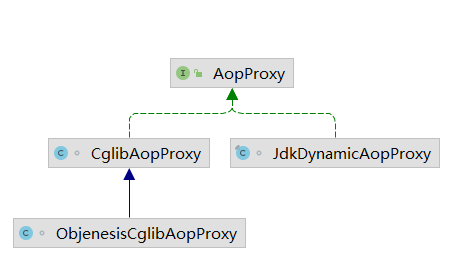

`DefaultAopProxyFactory.createAopProxy`选择jdk动态代理 或 cglib

- jdk动态代理只能对实现类接口的类生成代理
- cglib针对类生成代理，对指定类生成一个子类，覆盖其中的方法，final方法不能被代理

选择代理方式：

1. ~~`optimize`不推荐~~
2. `proxyTargetClass `设置`<aop:aspectj-autoproxy proxy-target-class="true"/>` 使用cglib
3. `hasNoUserSuppliedProxyInterfaces `是否存在代理接口

获取代理

1. jdk动态代理(`InvocationHandler`)，实现流程
    - 通过构造函数，传入目标对象
    - invoke方法，完成aop逻辑
    - getProxy 获取代理对象

    `JdkDynamicAopProxy.invoke`

    - 放过`equals, hashCode`等方法

    - 目标对象的内部自我调用无法实施切面中的增强，需要暴露代理(`AopContext.setCurrentProxy`)

    - 获取当前方法的拦截链(`ReflectiveMethodInvocation`)，调用(`proceed`)

      只是记录链接调用的计数器，记录当前调用链接的位置，递归调用`proceed`方法保证有序进行

      - 普通拦截器，直接调用`invoke`方法
      - `InterceptorAndDynamicMethodMatcher `调用里面的拦截器的方法

    - 返回结果


2. cglib代理 
   
   `CglibAopProxy.getProxy(java.lang.ClassLoader)`
   
   创建`Enhancer`，通过`getCallbacks`设置拦截器链(`DynamicAdvisedInterceptor`)
   
   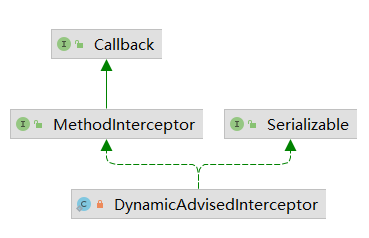
   
   `DynamicAdvisedInterceptor `继承 `MethodIntercept`
   
   ```text
   MethodIntercept接口的invoke方法: 先构造拦截器链，然后封装进行串联调用  
       jdk动态代理： 直接构造ReflectiveMethodInvocation  
       cglib代理：使用CglibMethodInvocation(extends ReflectiveMethodInvocation, 没有重写proceed方法)
       
   proceed方法会记录当前调用链接的位置，递归调用所有i拦截器的invoke方法
   ```

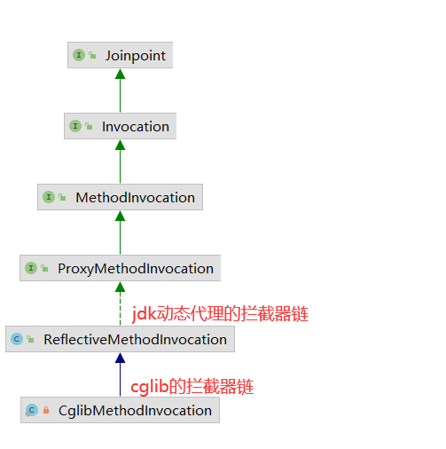

#### 7.4 静态aop使用

​	加载时织入(load-time weaving)：虚拟机载入字节码文件时动态织入`AspectJ`切面

#### 7.5 创建aop静态代理

​	Aop的静态代理(效率高)是在虚拟机启动时通过改变目标对象的字节码来完成对目标对象的增强


### 8. 数据库连接JDBC

#### 8.1 spring使用jdbc连接数据库代码

- 加载驱动
- 创建数据库连接对象Connection
- 创建Statement
- 执行sql
- 处理结果集ResultSet
- 关闭连接

#### 8.2 insert/update功能实现

```text
jdbcTemplate.update(sql, args, argTypes)
封装 参数 和 参数类型
update(sql, newArgTypePreparedStatementSetter(args, argTypes))
update(new SimplePreparedStatementCreator(sql), pss);
然后 设置参数， 调用execute
```

execute方法是最基础的操作，其他操作(update, query)都是传入不同的`PreparedStatementCallback`参数执行不同的逻辑

**execute方法逻辑**

接收两个参数

`JdbcTemplate#execute(PreparedStatementCreator psc, PreparedStatementCallback<T> action)`

1. 获取数据库连接`JdbcTemplate.getConnection`

   基于事务处理的特殊性，spring需要保证线程中的数据库操作采用同一个事务连接

2. 应用用户设定的输入参数

   `JdbcTemplate#applyStatementSettings`

   - `setFetchSize`: 当调用`rs.next`时，`ResultSet`会一次性从服务器中取多少行数据回来，下次`rs.next`时直接从内存中获取不需要网络交后，提高效率；该值可能会被某些jdbc驱动忽略，设置过大会造成内存上升

   - `setMaxRows`: 将`Statement`对象生成的所有`ResultSet`对象可以包含的最大行数限制设置为给定数

3. 调用回调函数

   `JdbcTemplate#doInPreparedStatement`
   处理 `PreparedStatementCallback` 类型的参数的 `doInPreparedStatement` 方法回调

   用于调用通用方法execute的时候无法处理的一些个性化处理方法

   `ArgumentPreparedStatementSetter.setValues` // 设置PreparedStatement需要的全部参数
   `ArgumentTypePreparedStatementSetter.setValues` // 设置PreparedStatement需要的全部参数

   遍历每个参数做类型匹配和转换，如果是集合需要进入内部递归解析内部属性

4. 警告处理

   `JdbcTemplate#handleWarnings`

   `SQLWarning`对象提供数据库访问警告信息的异常(`DataTruncation`)，警告可以从`Connection, Statement, ResultSet`中获得

5. 资源释放

   `JdbcTemplate#releaseConnection`
   如果当线程存在事务，说明共用数据库连接，只会调用`ConnectionHolder#released`方法进行连接数减1，不会真正的释放连接

   如果不存在事务就直接close

**update中的回调函数**

`PreparedStatementCallback`

`ArgumentTypePreparedStatementSetter`

```java
protected int update(final PreparedStatementCreator psc, final PreparedStatementSetter pss)
      throws DataAccessException {

   logger.debug("Executing prepared SQL update");
   return execute(psc, new PreparedStatementCallback<Integer>() {
      @Override
      public Integer doInPreparedStatement(PreparedStatement ps) throws SQLException {
         try {
            if (pss != null) {
               pss.setValues(ps); // 设置PreapredStatement需要的参数，pss具体是ArgumentTypePreparedStatementSetter
            }
            int rows = ps.executeUpdate();
            if (logger.isDebugEnabled()) {
               logger.debug("SQL update affected " + rows + " rows");
            }
            return rows;
         }
         finally {
            if (pss instanceof ParameterDisposer) {
               ((ParameterDisposer) pss).cleanupParameters();
            }
         }
      }
   });
}

String sql = "insert into user(name, age, gender) values (?, ?, ?)";

原生jdbc执行update语句:
PreparedStatement ps = conn.prepareStatement(sql);
ps.setString(1, user.getName());
ps.setInt(2, user.getAge());
ps.setString(3, user.getGender());

spring封装后:
new JdbcTemplate().update(sql,
		new Object[]{user.getName(), user.getAge(), user.getGender()},
		new int[]{Types.VARCHAR, Types.INTEGER, Types.VARCHAR});
```

#### 8.3 query功能实现

1. 如果sql语句有占位符`?`

`JdbcTemplate.query(PreparedStatementCreator, PreparedStatementSetter, ResultSetExtractor<T>)`

```java
public <T> T query(
      PreparedStatementCreator psc, final PreparedStatementSetter pss, final ResultSetExtractor<T> rse)
      throws DataAccessException {

   Assert.notNull(rse, "ResultSetExtractor must not be null");
   logger.debug("Executing prepared SQL query");

   return execute(psc, new PreparedStatementCallback<T>() {
      @Override
      public T doInPreparedStatement(PreparedStatement ps) throws SQLException {
         ResultSet rs = null;
         try {
            if (pss != null) {
               pss.setValues(ps);
            }
            rs = ps.executeQuery(); // 执行查询
            ResultSet rsToUse = rs;
            if (nativeJdbcExtractor != null) {
               rsToUse = nativeJdbcExtractor.getNativeResultSet(rs);
            }
            return rse.extractData(rsToUse); // 将结果集封装转换POJO，rse具体是RowMapperResultSetExtractor
         }
         finally {
            JdbcUtils.closeResultSet(rs);
            if (pss instanceof ParameterDisposer) {
               ((ParameterDisposer) pss).cleanupParameters();
            }
         }
      }
   });
}
```

`newArgTypePreparedStatementSetter` 

2. 如果sql语句没有占位符

`JdbcTemplate.query(String, ResultSetExtractor<T>)`

`execute `方法中 `Statement `的创建(`stmt = con.createStatement();`) -> `Statement`

有占位符时使用 `PreparedStatementCreator `创建 -> `PreparedStatement`

#### 8.4 queryForObject

使用`SingleColumnRowMapper`对返回结果进行封装。取出返回结果中的第一个值转换成对应的类型


### 9. 整合mybatis

#### 9.1 mybatis单独使用

​	`SqlSessionFactoryBuilder -> SqlSesionFactory -> SqlSession -> session.getMapper`

#### 9.2 spring整合mybatis

​	`SqlSessionFactoryBean + MapperFactoryBean`

#### 9.3 源码分析

**sqlSessionFactory创建**

`SqlSessionFactoryBean`封装了Mybatis的实现

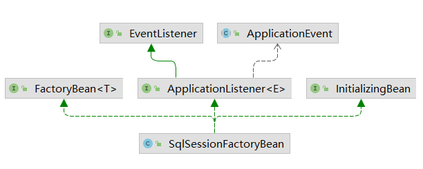

该类实现三个接口 

- `FactoryBean `通过`getBean`方法获得的对象时 `getObject `返回的，否则需要加`&`符号

- `InitializingBean `会在初始化时调用`afterPropertiesSet`方法进行bean的逻辑初始化

- `ApplicationEvent `

1. `SqlSessionFactoryBean`的初始化

   `afterPropertiesSet`中初始化`sqlSessionFactory`对象

   可以通过`configLocation`一个字段，直接引用mybatis的配置文件

   同时spring也直接整合了mybatis中其他属性的注入，可以不用`configLocation`字段，直接注入属性

2. 获取`SqlSessionFactoryBean`实例：会返回`SqlSesionFactory`对象

**MapperFactoryBean创建**

```text
单独使用mybatis时：UserMapper mapper = sqlSession.getMapper(UserMapper.class)
整合spring之后：UerMapper mapper = context.getBean(UserMapper.class)

MapperFactoryBean 实现了两个接口 InitializingBean, FactoryBean
```

1. 初始化(`afterPropertiesSet`)

   `MapperFactoryBean.checkDaoConfig`

   - 父类验证`sqlSession`(根据接口创建映射器代理)不为空，初始化工作时设定`sqlSessionFactory`属性时完成的

   - 映射接口的验证(接口是映射器的基础，`sqlSession`会根据接口动态创建代理类)

   - 映射文件存在性验证(检查映射接口是否存在映射文件)

2. 获取`MapperFactoryBean`

   该类实现类`FactoryBean`接口，通过`getBean`获取时会调用`getObject`函数返回

   ```java
   @Override
   public T getObject() throws Exception {
       return getSqlSession().getMapper(this.mapperInterface);
   }
   ```

**MapperScannerConfigurer**

扫描特定包，创建映射器

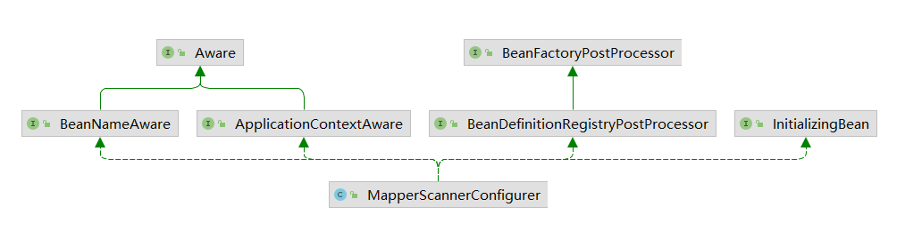

- `InitializingBean `接口：只验证了包名不能为空
- `BeanFactoryPostProcessor `：没有任何处理
- `BeanDefinitionRegistryPostProcessor.postProcessBeanDefinitionRegistry` 完成对指定路径的扫描

1. `MapperScannerConfigurer.processPropertyPlaceHolders` 完成属性文件加载

   `BeanDefinitionRegistries`会在应用启动的时候调用，早于`BeanFactoryPostProcessors(PropertyPlaceholderConfigurer)`

   `PropertyResourceConfigurers`还没有加载属性文件，因此手动找出定义的

   `PropertyResourceConfigurers`并进行调用保证属性可以正常工作

    1. 找到所有已经注册的`PropertyResourceConfigurers`
    2. 模拟spring中的环境(自己`new DefaultListableBeanFactory()`)使用处理器；找到bean中引入的属性文件中的属性进行替换

2. 根据配置属性生成过滤器
    1. `annotationClass`：`AnnotationTypeFilter`保证扫描文件时只接受标记有注解为`annotationClass`的接口。`AnnotationTypeFilter`包装扫描对应java文件时只接受有指定注解的接口

    2. `markerInterface`：`AssignableTypeFilter`保证扫描文件时只接受实现`markerInterface`接口的接口。`AssignableTypeFilter`包装扫描对应java文件时只接受实现指定接口的类

       (以上两个都放入`ClassPathScanningCandidateComponentProvider.includeFilters`)

    3. 全局默认处理：`TypeFilter`如果以上两个没有配置，会接受所有接口文件

    4. `package-info.java`处理：默认不作为逻辑实现接口(放入`ClassPathScanningCandidateComponentProvider.excludeFilters`)

3. 扫描java文件

   `ClassPathBeanDefinitionScanner.scan`
   `doScan`中`findCandidateComponents`方法根据传入的包路径信息结合文件路径拼接成文件绝对路径，同时完成文件扫描过程，并根据对应文件生成对应的bean，使用`ScannedGenericBeanDefinition`类型的bean承载信息，bean中只记录了resource和source信息，`iscandidateComponent`方法判断当前文件是否符合要求(使用上面的`includeFilters`, `excludeFilters`)

### 10. 事务

#### 10.1 jdbc使用事务

事务传播行为

| 事务传播行为  | 是否支持当前事务 | 当前存在事务 | 当前不存在事务 |
| :------------ | :--------------: | :----------- | :------------- |
| required      |        √         | 加入         | 创建           |
| supports      |        √         | 加入         | 不创建         |
| mandatory     |        √         | 加入         | 抛异常         |
| requires_new  |                  | 挂起，创建   | 创建           |
| not_supported |                  | 挂起         | 不创建         |
| never         |                  | 抛异常       | 不创建         |
| nested        |                  | 嵌套创建事务 | required       |

#### 10.2 事务自定义标签

`<tx:annotation-driven/>`

`TxNamespaceHandler`的`init`方法中注册`AnnotationDrivenBeanDefinitionParser`使用`AnnotationDrivenBeanDefinitionParser.parse`方法进行解析

`parse`方法找先判断`mode`属性，是使用`Spring aop`还是`aspectj`

**注册`InfrastructureAdvisorAutoProxyCreator`**

`AnnotationDrivenBeanDefinitionParser.AopAutoProxyConfigurer#configureAutoProxyCreator`

创建并注册三个bean

- TransactionAttributeSource  

- TransactionInterceptor(事务增强器(拦截器)invoke方法完成整个事务的逻辑)

- TransactionAttributeSourceAdvisor

  将1, 2注入3中

`AnnotationDrivenBeanDefinitionParser#registerTransactionalEventListenerFactory`
方法第一行中注册了`InfrastructureAdvisorAutoProxyCreator`

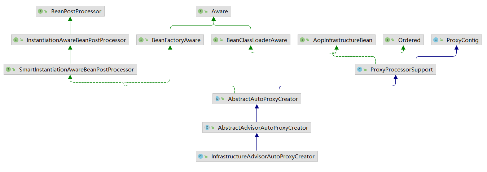

`InstanitationAwareBeanPostProcessor`保证该类会在bean初始化前后调用`postProcessBeforeInitialization, postProcessAfterInitialization`，在父类`AbstractAutoProxyCreator`中进行了实现

对指定bean进行封装(`wrapIfNecessary`)

- 找出指定bean对应的增强器(`AbstractAdvisorAutoProxyCreator#findCandidateAdvisors`)
- 根据找出的增强器创建代理(`AbstractAdvisorAutoProxyCreator#findAdvisorsThatCanApply`)

**获取对应class/method的增强器**

`AbstractAdvisorAutoProxyCreator#getAdvicesAndAdvisorsForBean`方法

- 获取增强器

  ```java
  // 是否也包含原型或作用域 bean 或仅包含单例
  // 是否初始化factory-bean
  BeanFactoryUtils.beanNamesForTypeIncludingAncestors(
        this.beanFactory, Advisor.class, true, false);
  // 前面注册的 TransactionAttributeSourceAdvisor 也会被找出来
  ```

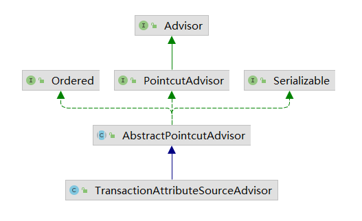

- 找出与`class`或`method`匹配的增强器

  解析自定义标签时注入了个`TransactionAttributeSourcePointcut`，通过它拿到`MethodMatcher`

  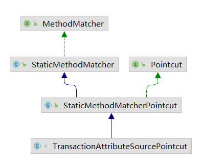

  

  获取对应类的所有接口加上类本身一起遍历，遍历过程中又对类中的方法再次遍历，一旦匹配成功便认为这个类适用于当前增强器。

  ```
  接口省的配置可以延伸到类中的每一个函数，match方法中进行额外的检测
  会使用TransactionAttributeSource#getTransactionAttribute(具体是AnnotationTransactionAttributeSource)
  先查缓存，找不到的话尝试加载
  AbstractFallbackTransactionAttributeSource#computeTransactionAttribute 提取事务标签
  ```

  **提取事务标签**

  `AbstractFallbackTransactionAttributeSource#computeTransactionAttribute`这里规定了只有被`public`修饰的方法才能被代理(`Modifier.isPublic(method.getModifiers())`)

  提取顺序：方法 -> 类 -> 接口方法 -> 接口

  `SpringTransactionAnnotationParser#parseTransactionAnnotation`解析注解

#### 10.3 事务增强器

`TransactionInterceptor`

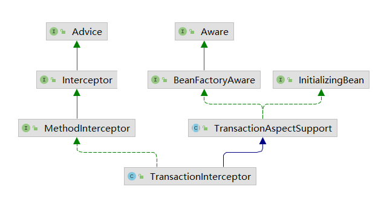

事务处理流程：

1. 获取事务属性(`TransactionAttribute`)

2. 加载配置中的`TransactionManager`

3. 不同的事务使用不同的逻辑

   编程式事务，声明式事务两者的区别：

   - 编程式事务不需要事务属性
   - `CallbackPreferringPlatformTransactionManager`实现了`TransactionManager`接口，暴露除一个方法用于执行事务处理中的回调

4. 在目标方法执行前获取事务并收集事务信息(`TransactionInfo`：包含事务属性信息，还有`PlateformTransactionManager, TransactionStatus`)

5. 执行目标方法

6. 如果有异常进行异常处理(回滚运行时异常)

7. 提交事务之前将事务信息清除

8. 提交事务

**创建事务**(`TransactionAspectSupport#createTransactionIfNecessary`)

- 如果没有指定名称则使用方法唯一标识，使用`DelegatingTransactionAttribute`封装`TransactionAttribute(实际为RuleBasedTransactionAttribute)`(获取事务属性时生成)

- 获取`TransactionStatus`

  `AbstractPlatformTransactionManager#getTransaction`

  - 获取事务

    使用`DataSourceTransactionManager`创建基于jdbc的事务实例，如果当前线程存在关于dataSource的连接，直接使用；对保存点的设置(是否允许保存点取决于是否设置了运行嵌入式事务)

  - 如果当前线程存在事务，转向嵌套事务处理

  - 事务超时设置验证

  - 事务传播行为设置验证

    当前线程不存在事务，但是事务传播行为设置为`mandatory`需要抛异常

    事务传播行为为`required, requires_new, nested`需要创建新事务

  - 构建`DefaultTransactionStatus`

  - 完善事务(包括设置`ConnectionHolder`，隔离级别，超时时间，如果是新连接绑定到当前线程)

    `DataSourceTransactionManager#doBegin`事务从这个方法开始

    - 尝试获取连接(让一个当前线程总connectionHolder已经存在不会再次获取，如果事务同步标识设置为true需要重新获取连接)
    - 设置数据库连接的隔离级别和只读标识(`connection#setReadOnly`)(`DataSourceUtils#prepareConnectionForTransaction`)
    - 更改默认的提交设置(如果是默认提交，需要将提交操作改为交给spring控制)
    - 设置标志位，标识当前连接已经被事务激活
    - 设置过期时间
    - 将`connectionHolder`绑定到当前线程(`TransactionSynchronizationManager#bindResource`)
    - 将事务记录在当前线程中(`AbstractPlatformTransactionManager#prepareSynchronization`)

- 根据指定的属性和status创建一个`TransactionInfo`

**处理已存在的事务**

`AbstractPlatformTransactionManager#handleExistingTransaction`事务传播行为处理

- nested

  嵌套事务(首选设置保存点的方式作为异常处理的回滚)

- requires_new

  当前方法必须在自己的事务中运行；如果当前存在事务，挂起，后续需要恢复

**准备事务信息**

`TransactionAspectSupport#prepareTransactionInfo`

将事务信息统一记录在`TransactionInfo`中，包含目标方法开始前的所有状态信息，一旦执行失败，通过其中的信息完成回滚等后续工作

**回滚事务**

`TransactionAspectSupport#completeTransactionAfterThrowing`

- 抛出异常时首先判断当前是否存在事务

- 判断是否回滚

  - 如果是，根据`TransactionStatus`中的信息进行回滚
  - 否则即使抛出异常也会提交


- 回滚条件

  ```java
  // DefaultTransactionAttribute#rollbackOn 默认只回滚RuntimeException, Error
  @Override
  public boolean rollbackOn(Throwable ex) {
  	return (ex instanceof RuntimeException || ex instanceof Error);
  }
  ```

- 回滚处理

  `AbstractPlatformTransactionManager#rollback`如果事务已完成，再次回滚会抛出异常

  自定义触发器的调用，激活所有`TransactionSynchronization`中的对应方法

  如果有保存点，说明当前事务为单独的线程则退到保存点(通常是nested嵌套事务)，使用`JdbcTransactionObjectSupport#rollbackToSavepoint`完成

  如果当前事务为独立的新事务，直接回滚，使用`DataSourceTransactionManager`回滚

  如果当前事务不是独立的事务，标记状态等到事务链执行完毕后统一回滚(通常是JTA)

- 回滚后信息清除

  设置完成状态避免重复调用(`DefaultTransactionStatus#setCompleted`)

  如果当前事务是新的同步状态，需要将绑定到当前线程的事务信息清除(将数据库连接从当前线程中解除绑定，释放连接，恢复数据库连接的自动提交属性，重置数据库连接)

  如果是新事务需要做清除资源的工作(如果当前事务是独立新创建的事务则在事务完成时释放数据库连接)

  如果在事务执行前有事务挂起，当事务执行结束后需要将挂起的事务恢复

**事务提交**

`TransactionAspectSupport#commitTransactionAfterReturning`

`AbstractPlatformTransactionManager#commit`

如果某个事务既没有保存点又不是新事务，spring会设置一个回滚标识

某个事务是另一个事务的嵌入事务，但是该事务不在spring的管理范围内或无法设置保存点，spring会通过设置回滚标识的方式禁止提交，等到外部事务提交时，如果发现当前事务设置了回滚标识则由外部事务统一进行整体事务回滚(事务没有被异常捕获的时候也不意味着一定会执行提交过程)

提交过程：

- 当前事务状态中有保存点信息不会提交

- 事务非新事务的时候也不会提交

  对于内嵌事务，spring的处理是将内嵌事务开始 之前设置保存点，一旦内嵌事务出现异常就根据保存点信息进行回滚，如果没有出现异常，内嵌事务不会单独提交，而是根据事务流由最外层事务负责提交，所以如果当前存在保存点信息说明不是最外层事务，不做保存操作

最后`connection.commit()`

### 11. SpringMvc


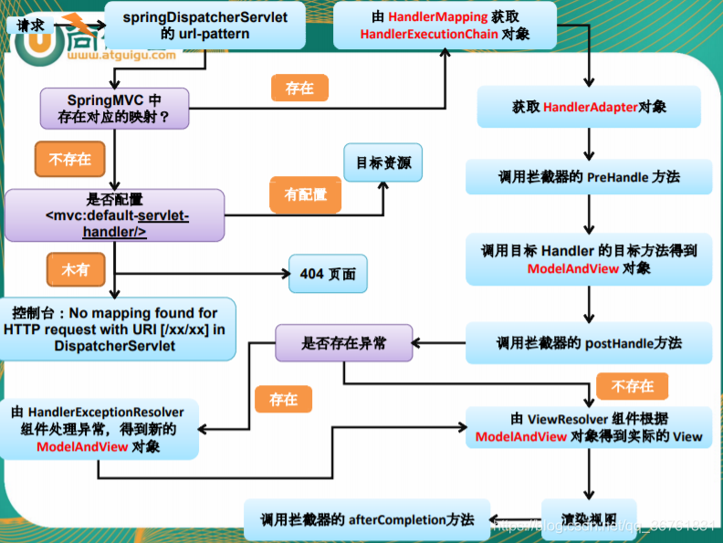


1. 用户发送请求至前端控制器DispatcherServlet。

2. DispatcherServlet收到请求调用HandlerMapping处理器映射器。

3. 处理器映射器找到具体的处理器(可以根据xml配置、注解进行查找)，生成处理器对象及处理器拦截器(如果有则生成)一并返回给DispatcherServlet。

4. DispatcherServlet调用HandlerAdapter处理器适配器。

5. HandlerAdapter经过适配调用具体的处理器(Controller，也叫后端控制器)。

6. Controller执行完成返回ModelAndView。

7. HandlerAdapter将controller执行结果ModelAndView返回给DispatcherServlet。

8. DispatcherServlet将ModelAndView传给ViewReslover视图解析器。

9. ViewReslover解析后返回具体View。

10. DispatcherServlet根据View进行渲染视图（即将模型数据填充至视图中）。

11. DispatcherServlet响应用户。


- DispatcherServlet：作为前端控制器，整个流程控制的中心，控制其它组件执行，统一调度，降低组件之间的耦合性，提高每个组件的扩展性。

- HandlerMapping：通过扩展处理器映射器实现不同的映射方式，例如：配置文件方式，实现接口方式，注解方式等。 

- HandlAdapter：通过扩展处理器适配器，支持更多类型的处理器。

- ViewResolver：通过扩展视图解析器，支持更多类型的视图解析，例如：jsp、freemarker、pdf、excel等。


#### 11.1 springMvc使用

web.xml配置

```xml
<?xml version="1.0" encoding="UTF-8"?>
<!DOCTYPE web-app PUBLIC "-//Sun Microsystems, Inc.//DTD Web Application 2.3//EN"
        "http://java.sun.com/dtd/web-app_2_3.dtd">
<web-app>
    <context-param>
        <param-name>contextConfigLocation</param-name>
        <param-value>/WEB-INF/app-servlet.xml</param-value>
    </context-param>

    <listener>
        <listener-class>org.springframework.web.context.ContextLoaderListener</listener-class>
    </listener>

    <!--会自动在WEB-INF目录下寻找 [servlet-name]-servlet.xml 这个文件，并在该目录中创建bean-->
    <!--也可以用contextConfigLocation参数自己配置-->
    <servlet>
        <servlet-name>app</servlet-name>
        <servlet-class>org.springframework.web.servlet.DispatcherServlet</servlet-class>
        <init-param>
            <param-name>contextConfigLocation</param-name>
            <param-value/>
        </init-param>
    </servlet>
    <servlet-mapping>
        <servlet-name>app</servlet-name>
        <url-pattern>/app/*</url-pattern>
    </servlet-mapping>

</web-app>
```

#### 11.2 ContextLoaderListener

```text
ApplicationContext context = new ClassPathXmlApplicationContext("applicationContext.xml");
web中，需要将路径通过param-value注册并使用ContextLoaderListener监听读取
<context-param>
    <param-name>contextConfigLocation</param-name>
    <param-value>classpath*:xml/mvc/applicationContext.xml</param-value>
</context-param>
```

`ContextLoadListener`: 在启动web容器时，自动装配`ApplicationContext`的配置信息，因为它实现了`ServletContextListener`接口

在web.xml配置这个监听器，启动容器时，会默认执行它实现的方法；使用该接口，能够在为客户端请求提供服务之前向`ServletContext`中添加任意对象；该对象在`ServletContext`启动时被创建，`ServletContext`的整个运行期间都可见；每个`web`应用都有一个`ServletContext`相关联，在应用启动时被创建，应用关闭时销毁，全局范围内有序，类似于应用中的全局变量

`ServletContextListener`的核心是初始化`WebApplicationContext`实例并存放至`ServletContext`中

**ServletContextListener接口的使用**

自定义一个`ServletContextListener(ServletContextListener)`，注册到`web.xml`中，可以在任意`servlet`或`jsp`中获取

**spring中的ContextLoaderListener类**

`ContextLoaderListener.contextInitialized`方法中初始化了`WebApplicationContext`

`WebApplicationContext(extends ApplicationContext)`类: 在`ApplicationContext`中追加了一些特定于web的操作和属性(类似于`ClasspathXmlApplicationContext`)

1. `WebApplicationContext`的存在性验证

   配置中只允许声明一次`ServletContextListener`

2. 创建`WebApplicationContext`实例 检测通过后，通过`createWebApplicationContext`方法创建实例

   初始化过程中，读取`ContextLoader`类同目录下的属性文件，根据配置提取将要实现`WebApplicationContext`接口的实现类，反射创建

3. 将实例记录在`servletContext`中

4. 映射当前的类加载器与创建的实例到全局变量`currentContextPerThread`中

#### 11.3 DispatcherServlet

**servlet使用**

servlet接口的实现类 生命周期：初始化，运行，销毁

- 初始化

  servlet容器加载servlet类，将class文件读取到内存中

  创建一个`ServletConfig`对象，其中包含servlet初始化的配置信息

  创建一个servlet对象

  调用`init`方法初始化

- 运行

  当servlet容器接收到请求后，会根据请求创建`servletRequest`和`servletResponse`对象，调用`service`方法处理请求

- 销毁

  先调用`destroy`方法(可以用来关闭资源)，然后销毁`servlet`对象 和 相关的`servletConfig`

  - javax.servlet ：定义了所有的servlet类必须实现或扩展的通用接口和类

  - javax.servlet.http：定义采用http通信协议的HttpServlet类

**DispatcherServlet初始化**
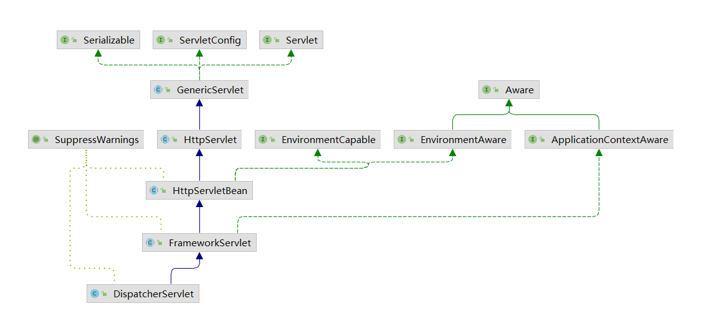

其父类`HttpServletBean`中重写了`init`方法，将当前servlet封装成`BeanWrapper`，便于进行属性注入

1. 封装及验证初始化参数

   处理`servlet`中`<init-param>`里面的参数放到`ServletConfigPropertyValues`中，可以通过`requiredProperties`对某些属性进行强制性验证

2. 将当前`servlet`实例转化成`BeanWrapper`方便设置值

3. 注册相对于`Resource`的属性编辑器

   属性注入过程中，如果遇到`Resource`类型的属性会使用`ResourceEditor`进行解析

4. 属性注入

5. `servletBean`初始化

   对`ContextLoaderListener`加载的时候创建的`WebApplicationContext`对象进一步初始化 ，通过父类`FrameworkServlet`重写`initServletBean`完成，并这里统计了一下初始化时间，真正的初始化交给`initWebApplicationContext`方法

**WebApplicationContext初始化**

创建或刷新`WebApplicationContext`实例，并对`servlet`功能使用的变量进行初始化

1. 寻找或创建对应的`WebApplicationContext`实例
    1. 通过构造函数的注入进行初始化
    
    2. 通过`web.xml`中配置的servlet参数`contextAttribute`查找`ServletContext`中的对应属性
    
       `ContextLoaderListener`加载时会创建`WebApplicationContext`实例，并将实例以`WebApplicationContext.class.getName() + ".ROOT"`为key放入`ServletContext`中
    
    3. 如果上面两个都没有完成初始化，重新创建`WebApplicationContext`实例(默认是`XmlWebApplicationContext`)
    
2. `configureAndRefreshWebApplicationContext`

   使用父类`AbstractApplicationContext`提供的refresh进行配置文件加载

3. 刷新`FrameworkServlet#onRefresh`

   `FrameServlet`提供的方法，`DispatcherServlet`进行了重写，用来刷新`spring`在`web`功能中必须使用的全局变量，依次初始化以下九个对象

    1. `MultipartResolver` ：处理文件上传

    2. `LocalResolver`
       
       国际化配置
       
        1. 基于`url`参数的配置(`url`中添加参数`locale=zh_CN`)
        2. 基于`session`的配置
        3. 基于`cookie`的配置(获取`cookie`中的`Locale`对象)
       
    3. `ThemeResolver`

       主题功能

        1. 主题资源

           `ThemeSource`接口，存放主题信息的资源

        2. 主题解析器
            1. 固定的主题解析器(`FixedThemeResolver`)
            2. 基于`session`的主题解析器(`SessionThemeResolver`)
            3. 基于`cookie`的主题解析器(`CookieThemeResolver`)
            4. 抽象的主题解析器(用户自定义 `AbstractThemeResolver`)

        3. 拦截器

           `ThemeChangeInterceptor`根据用户请求修改主题

    4. `HandlerMappings`

       `DispatcherServlet`将请求提交给`HandlerMapping`，然后根据`WebApplicationContext`的配置传给相应的`Controller`，自己可以提供多个`HandlerMapping`，根据优先级排序，也可以通过参数只指定一个，默认加载`org.springframework.web.servlet.DispatcherServlet.properties`文件中的默认配置(`BeanNameUrlHandlerMapping, RequestMappingHandlerMapping, RouterFunctionMapping`)

    5. `HandlerAdapters`

       适配器，如果没有配置会默认加载三个

        1. `HttpRequestsHandlerAdapter`(应用于远程调用)
        2. `SimpleControllerHandlerAdapter`简单控制器处理器适配器
        3. `AnnotationMethodHandlerAdapter`注解方法处理器适配器

    6. `HandlerExceptionResolver` 

       异常处理器，`resolveException`方法需要返回一个`ModelAndView`;

    7. `RequestToViewNameTranslator` 

       `Controller`处理器中没有返回`view`对象或视图名称，并且没有直接向`response`的输出流中写入数据时，`spring`会提供一个逻辑视图名称，其默认实现为`DefaultRequestToViewNameTranslator`，该类会将获取到请求的`uri`，根据提供的属性做一些改造，将改造之后的结果作为视图名称返回，允许用户的配置：` prefix, suffix, separator, stripLeadingSlash, stripTrailingSlash, stripExtension`

    8. `ViewResolver` 

       视图解析器，默认是`InternalResourceViewResolver`

    9. `FlashMapManager`

       提供请求存储属性；`flash attributes`在重定向前暂存以便重定向之后还能使用，并立刻删除

       - `FlashMap`: 用于保持 `flash map`

       - `FlashMapManager`: 用于存储，管理，检测`FlashMap`

       可以通过 `RequestContextUtils` 获取

       ```java
       // 获取当前线程的request
       HttpServletRequest request = ((ServletRequestAttributes)(RequestContextHolder.getRequestAttributes())).getRequest();
       // 获取当前线程的flashmap
       FlashMap flashmap = RequestContextUtils.getOutputFlashMap(request);
       FlashMap flashmap = ((FlashMap)(request.getAttribute(DispatcherServlet.OUTPUT_FLASH_MAP_ATTRIBUTE)));
       ```

#### 11.4 DispatcherServlet的逻辑处理

`FrameworkServlet`

`doGet/doPost -> processRequest -> doService(DispatcherServlet) -> doDispatch`

1. 提取线程中的`LocaleContext, RequestAttributes` 两个属性，保证请求后还能恢复

2. 根据当前`request`创建对应`LocaleContext, RequestAttributes`，绑定到当前线程

3. 调用`doService`方法

   将一些变量放入`request`(`localeResolver, themeResolver`等)

   **`doDispatch`**:

    1. 如果`request`是`MultipartContext`类型(判断`Content-Type`是否以`multipart`开头)，需要转换成`MultipartHttpServletRequest`类型

    2. 根据`request`寻找`Handler`，并加入拦截器到执行链(如果没有找到，通过`response`返回错误信息)

       `spring`启动时会将所有映射类型的`bean`注册到`this.handlerMappings中`
       根据`url`找到匹配的`Controller`返回，如果没有找到尝试去查找默认处理器，如果查找到的是`string`，意味着返回的是`bean`名称，根据名称取擦或者`bean`

       用`HandlerExecutionChain`对返回的`Handler`进行封装

       - 截取用于匹配的路径(从request中获取属性`javax.servlet.include.request_uri, javax.servlet.include.context_path`)，根据路径寻找`Handler`(`AbstractUrlHandlerMapping#getHandlerInternal`)，考虑直接匹配和通配符两种情况(`AbstractUrlHandlerMapping#lookupHandler`)

       - 如果是`/`，使用`RootHandler`处理

       - 如果找不到用默认的`Handler`

       - 如果是`string`，从容器中`getBean(handlerName)`

       - 最后将`Handler`封装成`HandlerExecutionChain`(`AbstractUrlHandlerMapping#buildPathExposingHandler`)并加入两个拦截器(`PathExposingHandlerInterceptor, UriTemplateVariablesHandlerInterceptor`)，如果`url`没有匹配的`Handler`，可以设置默认的来处理，如果没有设置只能通过`response`返回错误信息(`DispatcherServlet#noHandlerFound`)

       - 加入拦截器到执行链

         `AbstractHandlerMapping#getHandlerExecutionChain`

    3. 根据`Handler`寻找`HandlerAdapter`

       默认情况下普通`web`请求会交给`SimpleControllerHandlerAdapter`(处理`Controller`接口的实现类)

       遍历所有的适配器选择合适的返回(匹配逻辑封装在具体的适配器中)

       ```java
       // SimpleControllerHandlerAdapter 用于处理普通web请求，将逻辑封装到Controller的子类中
       @Override
       public boolean supports(Object handler) {
          return (handler instanceof Controller);
       }
       ```

    4. 缓存处理

       如果当前`Handler`支持`last-modified`头处理，需要实现`LastModified`接口；Spring判断是否过期是通过判断请求的`if-modified-since`是否大于当前的`getLastModified`方法的时间戳，如果是则认为没有修改

    5. `HandlerInterceptor`处理

       调用所有拦截器的`preHandler`方法(如果某个拦截器返回`false`直接返回)

    6. 调用`HandlerAdapter#handle`方法，真正的激活`handler`并返回视图

       ```java
       // SimpleControllerHandlerAdapter 
       @Override
       public ModelAndView handle(HttpServletRequest request, HttpServletResponse response, Object handler)
             throws Exception {
       
          return ((Controller) handler).handleRequest(request, response);
       }
       
       // AbstractController#handleRequest 这里真正调用Controller中重写的方法
       @Override
       public ModelAndView handleRequest(HttpServletRequest request, HttpServletResponse response)
       	throws Exception {
       	// 如果需要session内同步会通过互斥量进行同步 ...
       	return handleRequestInternal(request, response);
       }
       ```

    7. 视图名称转换(添加前后缀)

    8. 调用所有拦截器的`postHandler`方法(如果有异常也会返回`ModelAndView`)

    9. 异常视图的处理(`DispatcherServlet#processDispatchResult`)

       出现异常后，将逻辑引导至`DispatcherServlet#processHandlerException`使用`HandlerExceptionResolver`进行异常处理

    10. 处理返回的视图名称(如果需要添加前后缀)

    11. 调用所有拦截器的`postHandler`方法

    12. 如果`Handler`处理后返回了`view`，需要做页面处理

        `DispatcherServlet#processDispatchResult`，`DispatcherServlet#render`处理页面跳转

        1. 解析视图名称

           `DispatcherServlet#resolveViewName` `InternalResourceViewResolver`

           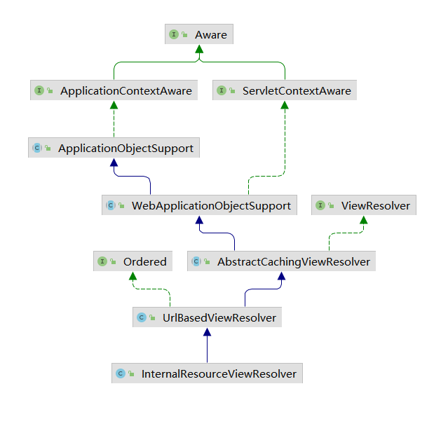

           父类`AbstractCachingVieResolver`中的`resolveViewName`方法解析视图名称

           不存在缓存的情况下直接创建视图(`UrlBasedViewResolver#loadView`)，否则从缓存中提取

           父类`UrlBasedViewResolver`中重写了`createView`函数，处理前缀后缀(forward, redirect, string等)，并且提供了缓存支持，添加一些必须的属性

        2. 页面跳转 `AbstractView#render`

           处理跳转逻辑，将放入`ModelAndView`的属性放入`request`中(`InternalResourceView#renderMergedOutputModel`)，以便在页面上直接通过jstl语法或原始request获取

    13. 完成处理后激活触发器

        `DispatcherServlet#triggerAfterCompletion`

4. 请求处理结束后恢复线程到原始状态

5. 请求结束以后无论是否成功发布事件通知


#### 11.5 HandlerAdapter

将请求 url 映射到 handler，然后将 handler 交给 HandlerAdapter 处理

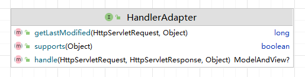

supports()方法用来判断当前HandlerAdapter是否可以调用处理handler;

handle()方法用来调用handler，具体的来处理请求。


- SimpleServletHandlerAdapter `javax.servlet.Servlet`
- SimpleControllerHandlerAdapter `org.springframework.web.servlet.mvc.Controller`接口
- HttpRequestHandlerAdapter `org.springframework.web.HttpRequestHandler` 访问静态资源
- RequestMappingHandlerAdapter `org.springframework.web.method.HandlerMethod` 反射调用
- AnnotationMethodHandlerAdapter 注解类处理器


#### 11.6 HttpMessageConverter 消息转换器

@RequestBody 和 @ResponseBody 完成 请求报文 到 对象   和  对象 到 相应报文 的转换

**HandlerMethodArgumentResolver 和 HandlerMethodReturnValueHandler**


SpringMVC处理请求大致是这样的：首先被DispatcherServlet截获，DispatcherServlet通过handlerMapping获得HandlerExecutionChain，然后获得HandlerAdapter。HandlerAdapter在内部对于每个请求，都会实例化一个ServletInvocableHandlerMethod进行处理，ServletInvocableHandlerMethod在进行处理的时候，会分两部分别对请求跟响应进行处理。之后HandlerAdapter得到ModelAndView，然后做相应的处理。


@Controller 中参数映射 `org.springframework.web.servlet.mvc.method.annotation.RequestMappingHandlerAdapter#afterPropertiesSet`

@ResponseBody 注解的话最终返回值会被 RequestResponseBodyMethodProcessor 这个HandlerMethodReturnValueHandler 实现类处理

RequestResponseBodyMethodProcessor支持的请求类型是Controller方法参数中带有@RequestBody注解，支持的响应类型是Controller方法带有@ResponseBody注解。 


常用的HandlerMethodArgumentResolver实现类(本文粗略讲下，有兴趣的读者可自行研究)。

1. RequestParamMethodArgumentResolver

    支持带有@RequestParam注解的参数或带有MultipartFile类型的参数

2. RequestParamMapMethodArgumentResolver

    支持带有@RequestParam注解的参数 && @RequestParam注解的属性value存在 && 参数类型是实现Map接口的属性

3. PathVariableMethodArgumentResolver

   支持带有@PathVariable注解的参数 且如果参数实现了Map接口，@PathVariable注解需带有value属性

4. MatrixVariableMethodArgumentResolver

   支持带有@MatrixVariable注解的参数 且如果参数实现了Map接口，@MatrixVariable注解需带有value属性 

5. RequestResponseBodyMethodProcessor

    本文已分析过

6. ServletRequestMethodArgumentResolver

    参数类型是实现或继承或是WebRequest、ServletRequest、MultipartRequest、HttpSession、Principal、Locale、TimeZone、InputStream、Reader、HttpMethod这些类。

   **（这就是为何我们在Controller中的方法里添加一个HttpServletRequest参数，Spring会为我们自动获得HttpServletRequest对象的原因）**

7. ServletResponseMethodArgumentResolver

    参数类型是实现或继承或是ServletResponse、OutputStream、Writer这些类

8. RedirectAttributesMethodArgumentResolver

    参数是实现了RedirectAttributes接口的类

9. HttpEntityMethodProcessor

    参数类型是HttpEntity

从名字我们也看的出来， 以Resolver结尾的是实现了HandlerMethodArgumentResolver接口的类，以Processor结尾的是实现了HandlerMethodArgumentResolver和HandlerMethodReturnValueHandler的类。


常用的HandlerMethodReturnValueHandler实现类。

1. ModelAndViewMethodReturnValueHandler

   返回值类型是ModelAndView或其子类

2. ModelMethodProcessor

   返回值类型是Model或其子类

3. ViewMethodReturnValueHandler

   返回值类型是View或其子类 

4. HttpHeadersReturnValueHandler

   返回值类型是HttpHeaders或其子类 

5. ModelAttributeMethodProcessor

   返回值有@ModelAttribute注解

6. ViewNameMethodReturnValueHandler

   返回值是void或String


#### 11.7 mvc 的反射调用

- org.springframework.web.method.support.InvocableHandlerMethod#doInvoke

- org.springframework.web.method.support.InvocableHandlerMethod#invokeForRequest

- org.springframework.web.servlet.mvc.method.annotation.ServletInvocableHandlerMethod#invokeAndHandle

- org.springframework.web.servlet.mvc.method.annotation.RequestMappingHandlerAdapter#invokeHandlerMethod

- org.springframework.web.servlet.mvc.method.annotation.RequestMappingHandlerAdapter#handleInternal

- org.springframework.web.servlet.mvc.method.AbstractHandlerMethodAdapter#handle

- org.springframework.web.servlet.HandlerAdapter#handle

- org.springframework.web.servlet.DispatcherServlet#doDispatch

- org.springframework.web.servlet.FrameworkServlet#doService


#### 11.8 查找 Controller

1. HandlerMethod ：封装了方法参数、方法注解，方法返回值等众多元素的类

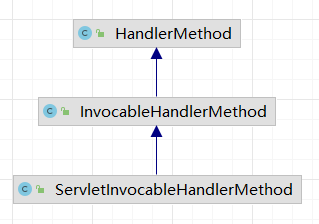

- InvocableHandlerMethod 处理请求

- ServletInvocableHandlerMethod 处理响应 (处理请求类的子类)，该类在 HandlerAdapter(RequestMappingHandlerAdapter) 对每个请求处理过程中，都会实例化出一个，分别对请求和返回进行处理

2. MethodParameter：封装了**方法参数**具体信息的工具类，包括参数的的索引位置，类型，注解，参数名等信息

3. RequestCondition 接口 请求条件

   PatternsRequestCondition 会自动在路径前补上 `/`

4. RequestMappingInfo 封装各种请求映射条件并实现 RequestCondition 接口

   ```java
   RequestMappingInfo.Builder builder = RequestMappingInfo
         .paths(resolveEmbeddedValuesInPatterns(requestMapping.path()))
         .methods(requestMapping.method())
         .params(requestMapping.params())
         .headers(requestMapping.headers())
         .consumes(requestMapping.consumes())
         .produces(requestMapping.produces())
         .mappingName(requestMapping.name());
   ```

5. RequestMappingHandlerMapping 处理请求 与 HandlerMethod 映射关系的类


**SpringMVC 的初始化操作**

`org.springframework.web.servlet.handler.AbstractHandlerMethodMapping#initHandlerMethods`

找出 spring 容器中所有的 bean，检测是否被 @Controller 或 @RequestMapping 修饰，遍历提取信息

初始化 Map<Method, RequestMappingInfo>

- 创建 RequestMappingInfo：找到方法中 @RequestMapping 注解，类 和 方法 上都存在该注解的话需要进行合并`org.springframework.web.servlet.mvc.condition.RequestCondition#combine`

  PatternsRequestCondition    AntPathMatcher

  RequestMethodsRequestCondition   

注册 HandlerMethod


SpringMVC的分发器DispatcherServlet会根据浏览器的请求地址获得HandlerExecutionChain

org.springframework.web.servlet.handler.AbstractHandlerMethodMapping#lookupHandlerMethod


- 基于Controller方法的映射 RequestMappingHandlerMapping 

- 静态文件映射 SimpleUrlHandlerMapping

  ```java
  <mvc:resources location="/static/" mapping="/static/**"/>
  或
  WebMvcConfigurer 重新 addResourceHandlers
  ```

   Spring解析配置文件会使用 ResourcesBeanDefinitionParser 进行解析的时候，会实例化出 SimpleUrlHandlerMapping  ->  ResourceHttpRequestHandler


### 12. 远程服务

​	Java远程方法调用 Java RMI (Java Remote Method Invocation)

### 13 spring消息

​	Java消息服务 JMS (Java Message Service)

### 14 springboot体系原理

#### 14.2 Starter创建

​	使用`META-INF/spring.factories`声明配置文件的位置

#### 14.3 SpringApplication的启动

`SpringApplication#run`:

`createApplicationContext`: 根据`this.webEnvironment`决定实例化哪一个`ApplicationContext`

`prepareContext`: 创建`BeanDefinitionLoader`加载`BeanDefinition`

`refreshContext`:  创建容器

**SpringContext的创建**

根据`this.webEnvironment`参数(`spring`如何自动化启动`tomcat`)决定实例化哪一个`ApplicationContext`

(`AnnotatonConfigEmbeddedWebApplicationContext, ConfigurableWebApplicationContext`)

**bean的加载**

`SpringApplication#prepareContext`，使用`BeanDefinitionLoader`加载Bean

**扩展属性加载**

`SpringApplication#refreshContext 中的 applicationContext.refresh()`

`Spring`内置了原有的启动类，在启动的时候启动并刷新

`org.springframework.context.annotation.AnnotationConfigApplicationContext`

#### 14.4 Starter自动化配置原理

`Starter`生效分析：

`@SpringBootApplication`注解分析

`@SpringBootApplication -> **@EnableAutoConfiguration** -> @Import -> EnableAutoConfigurationImportSelector.class / AutoConfigurationImportSelector.class`

该类只有一个函数`isEnabled`，调用者`AutoConfigurationImportSelector`

**spring.factories的加载**

```text
AutoConfigurationImportSelector#selectImports -> getCandidateConfigurations -> SpringFactoriesLoader.loadFactoryNames -> SpringFactoriesLoader#loadSpringFactories
通过硬编码读取了配置文件`META-INF/spring.factories`里面的配置类
```

**factories时序图**

`EmbeddedWebApplicationContext -> PostProcessorRregistrationDelegate -> ConfigurationClassPostProcessor -> ConfigurationClassParser -> AutoConfigurationImportSelector`

`AutoConfigurationImportSelector#getAutoConfigurationEntry`获取了所有的配置文件类

通过`BeanDefinitionRegistryPostProcessor`扩展并实现`ConfigurationClassPostProcessor`

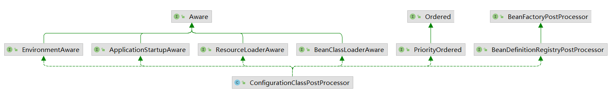

**配置类解**

`Starter`需要将自身入口配置写入`META-INF`文件下的`spring.factories`

`AutoConfigurationImportSelector#selectImports`返回上面文件中的配置类(`String[]`) // TODO 没有找到

`ConfigurationClassParser#processImports`调用上面的方法，Spring在启动的时候会扫描所有jar中的`spring.factories` 处理流程：

1. `ConfigurationClassPostProcessor`作为`spring`扩展是`springboot`一系列功能的基础入口

2. `ConfigurationClassParser`作为解析职责的基本处理类，包含各种解析处理逻辑

   `parse`方法处理`@Import, @Bean, @ImportResource, @PropertiesSource, @ComponentScan`等注解

3. 将所有的解析结果放在`parse`的`configurationClasses`中，对这个属性进行统一的bean硬编码注册，注册功能交给`ConfigurationClassBeanDefinitionReader#loadBeanDefinitions`

4. `parse`方法中先处理自身能扫描到的`bean`注解，然后处理`spring.factories`定义的配置(`AutoConfigurationImportSelector#selectImports`)，返回的配置需要进一步解析(可能`@ComponentScan`中扫描出另一个`@ComponentScan`)，方法中会存在递归

**ComponentScan切入点**

`ConfigurationClassParser.doProcessConfigurationClass`处理各种注解

先找出所有的`@ComponentScan`注解信息，委托给`ComponentScanAnnotationParser`进行扫描

使用`ClassPathBeanDefinitionScanner`来解析注解中的数据(`includeFilters, basePackage`等)

#### 14.5 Condition机制实现

**Conditional使用**

```text
@ConditionalOnProperty(prefix="prefix", name="name", havingValue="value")
@ConditionalOnProperty(value="prefix.name", havingValue="value")
只有application.properties中有 prefix.name=value 这条数据时才会生效
```

`OnPropertyCondition#getMatchOutcome`处理了这个注解，返回`ConditionalOutcome`

`OnPropertyCondition#annotationAttributesFromMultiValueMap`负责扫描`ConditionOnProperty`中配置的的注解信息，扫描完成后`OnPropertyCondition#determineOutcome`完成核心验证逻辑，`PropertyResolver`包含所有的配置属性信息用来验证是否通过

**调用切入点**

`OnPropertyCondition#getMatchOutcome`的调用者`ConfigurationClassParser#processConfigurationClass`是判断逻辑的切入点
`ConditionEvaluator#shouldSkip`方法中：

1. `ConditionEvaluator.getConditionClasses`获取`Condition`
2. `Condition.matches`匹配

#### 14.6 属性自动化配置实现

**使用**

```text
@Value("${age}") // 注入application.properties中的属性
```

**原理**

`QualifierAnnotationAutowireCandidateResolver#findValue`获取表达式的值

`DefaultListableBeanFactory#resolveEmbeddedValue`替换表达式的值

`StringValueResolver`进行属性解析，该类实现了`PropertySourcesPlaceholderConfigurer#postProcessBeanFactory`接口
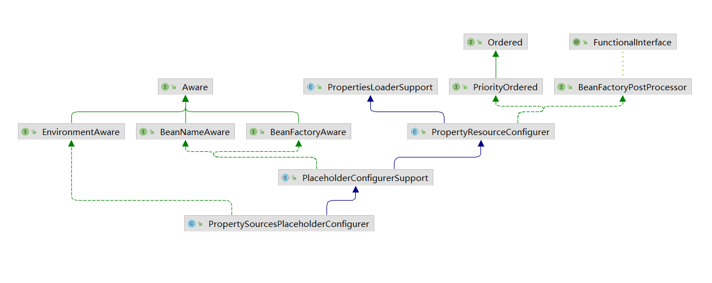

初始化过程：

1. 初始化`MutablePropertySources`
2. 初始化`PropertySourcesPropertyResolver`
3. 初始化`StringValueResolver`
4. 注册`StringValueResolver`


