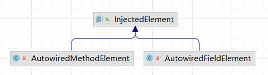
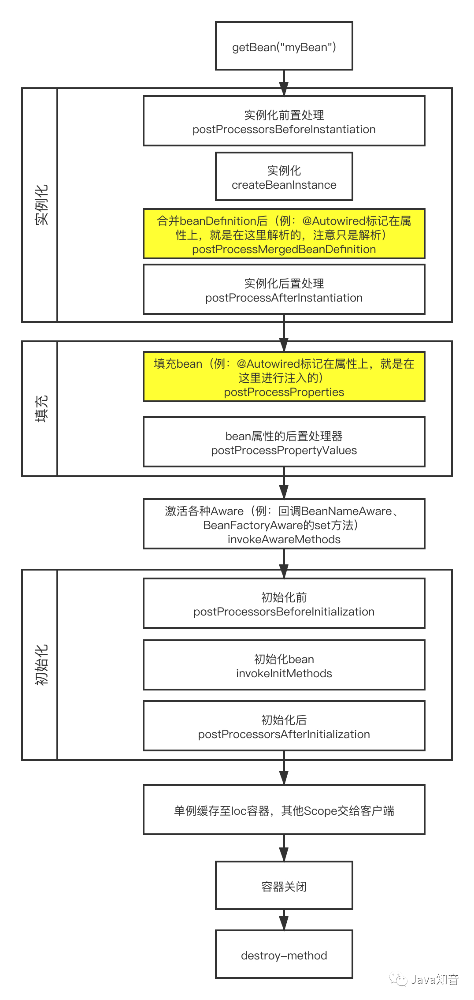

### @Configuration的作用

被`@Configuration`注解的类会被代理

`AnnotationConfigApplicationContext -> refresh() -> invokeBeanFactoryPostProcessors()`

判断被注解的类是否已经被代理(通过接口判断`EnhancedConfiguration.class extends BeanFactoryAware`)

对没被代理的类放入map, 全部进行cglib代理(继承该类；jdk动态代理基于接口)，继承的时候实现一个接口`EnhancedConfiguration`，

同时为代理类加一个 `BeanFactory` 类型的`$$beanFactory`字段通过`BeanFactoryAwareGeneratorStrategy.class`
完成字段的添加，通过`BeanFactoryAwareMethodInterceptor`完成字段的赋值)
重写被`@Bean`注解的方法，通过上面的`$$beanFactory`生成

(用过滤器实现`MethodInterceptor`如果是第一次生成(判断方法名是否相同(当前正在执行的方法 和 被调用方法))去调用父类的方法new对象，否则用工厂getBean获取)

[代码解析](https://blog.csdn.net/qq_37561309/article/details/107979128)

### bean的生命周期

```java
new AnnotationConfigApplicationContext(Config.class);

this(); // 会调用父类的构造函数，这里会创建BeanFactory(DefaultListableBeanFactory，用来实例化对象)
register(componentClasses); // 为被@Configuration修饰的类创建BeanDefinition注册进去
refresh(); // 完成容器的初始化 synchronized

invokeBeanFactoryPostProcessors(); // 扫描类，处理@Import, @ImportResource(引入xml文件)
  // 对每个类创建BeanDefinition对象放入beanDefinitionMap
  // 判断类是否实现BeanFactoryPostProcessor, 进行处理
finishBeanFactoryInitialization(); // 实例化bean对象
  // beanFactory.preInstantiateSingletons();
```

(BeanFactoryPostProcessor ---> 普通Bean构造方法 ---> 设置依赖或属性 ---> @PostConstruct ---> InitializingBean ---> initMethod )

Spring容器的内容：

​    `BeanDefinition, BeanDefinitionMap, BeanFactoryPostProcessor, BeanFactory, singletonObjects(存放创建完成的单例对象，大部分对象都存在这里)...`

实例化bean的过程(需要处理循环依赖(单例才可以))：

​    `DefaultListableBeanFactory#preInstantiateSingletons` -> `getBean` -> `AbstractBeanFactory.doGetBean()`
-> `getSingleton返回null` -> 进行各种验证 -> `getSingleton` -> `beforeSingletonCreation将当前对象放入正在创建的对象集合`
-> `getObject(调用createBean)` ->

从`singletonObjects`中获取bean，不为空直接返回

`DefaultSingletonBeanRegistry`

`isSingletonCurrentlyInCreation` 判断对象是否在创建中(bean有循环依赖，所以有中间状态, `singletonsCurrentlyInCreation`记录正在创建的bean)

**BeanPostProcessor**

bean 先构造函数，在9个地方调用了6个后置处理器

1. ApplicationContextAwareProcessor
2. ImportAwareBeanPostProcessor
3. BeanPostProcessorChecker
4. CommonAnnotationBeanPostProcessor (@Resource)
5. AutowiredAnnotationBeanPostProcessor (@Autowired)
6. ApplicationListenerDetector

`populateBean` 完成被@Autowired修饰的属性注入

`org.springframework.beans.factory.support.AbstractAutowireCapableBeanFactory.resolveBeforeInstantiation`
`InstantiationAwareBeanPostProcessor`

BeanPostProcessor 插手bean的初始化(Initialization)过程

(aop就是在这里将目标对象替换成了代理对象)

实例化是整个过程包括: 创建 + 初始化

new创建对象 -> 执行所有的BeanPostProcessor -> @PostConstruct

### SpringAop AspectJ

概念:

1. Aspect 切面(通知 和 切入点 的结合)
2. advice 通知(想要的功能 日志，权限，事务)
3. join point 连接点(允许使用通知的地方，spring只允许方法连接点，方法前后都是)
4. pointcut 切入点(连接点中选择几个，真正的放入通知)
5. introduction 引入(向现有的类中添加新方法属性)
5. target object 目标对象(被通知的对象，真正的业务逻辑)
6. aop proxy 代理
7. weaving 织入(把切面应用到目标对象创建代理对象的过程)

1. before advice 前置通知
2. after returning advice 正常返回通知
3. after throwing advice 异常返回通知
4. after (finally) advice 返回通知
5. around advice 环绕通知

```text
ProceedingJoinPoint extends JoinPoint
```

@AspectJ

开启aop的方式：

1. `@EnableAspectJAutoProxy(proxyTargetClass=true)` java

   `proxyTargetClass` 参数表示采用cglib动态代理

2. `<aop:aspectj-autoproxy/>` xml

两种动态代理方式：

1. jdk动态代理基于接口 `obj extends Proxy implements aInterface`

2. cglib基于继承 `obj extends Service implements aInterface`

定义切面的几种方式：

1. `execution(modifiers-pattern? ret-type-pattern declaring-type-pattern?name-pattern(param-pattern)throws-pattern?)`
   最小粒度是方法(private方法不能被代理(无法被继承))
2. `within(com.XXX)` 最小粒度是类
3. `this(类)` 限制代理对象
4. `target` 限制代理的目标对象
5. `args(java.lang.String)` 限制方法参数
6. `@annotation` 限制方法上面有没有指定注解
7. `@within` 限制类上面有没有指定注解
8. 加上`@`表示注解(没有~~`@execution`~~)

```text
execution(* com.xyz.service.AccountService.*(..))
within(com.xyz.service..*)
@annotation(org.springframework.transaction.annotation.Transactional) // 检查方法上面的注解
@within(org.springframework.transaction.annotation.Transactional) // 检查类上面的注解
```

ioc 和 aop 都是编程目标，没有spring也能实现aop(aspectJ)

springAOP当中的对象必须放在ioc容器中

aop如何被代理(`AnnotationAwareAspectJAutoProxyCreator` `AbstractAutoProxyCreator.createProxy`)

启用aop之后，getBean(ABean.class)拿不到目标对象的(被代理了)

getBean方法：

先`DefaultSingletonBeanRegistry.getSingleton` ，如果拿不到`AbstractAutowireCapableBeanFactory#createBean` -> `doCreateBean(创建原始的对象(不是代理))` -> `createBeanInstance`返回`BeanWrapper#getWrappedInstance` -> `initializeBean(完成代理(将目标对象替换成代理对象bean))` ->（ `applyBeanPostProcessorsBeforeInitialization` -> `invokeInitMethods执行bean生命周期中的回调方法`->） `applyBeanPostProcessorsAfterInitialization(里面有一个AnnotationAwareAspectJAutoProxyCreator这个BeanPostProcessor通过添加注解(@EnableApsectJAutoProxy)注册进去(AopConfigUtils#registerAspectJAnnotationAutoProxyCreatorIfNecessary))` -> `AbstractAutoProxyCreator#postProcessAfterInitialization` -> `AbstractAutoProxyCreator#createProxy `-> `createAopProxy()(jdk或者cglib).getProxy(classLoader);`

BeanFactoryPostProcessor

一个方法 postProcessBeanFactory

beanFactory的后置处理器，在BeanFactory标准初始化后调用；所有BeanDefinition**已经被加载**，但尚未实例化任何bean

创建ioc容器，refresh -> invokeBeanFactoryPostProcessors -> invokeBeanFactoryPostProcessors

执行所有的BeanFactoryPostProcessor，在bean创建之前运行

BeanDefinitionRegistryPostProcessor 一个子接口 执行时优先于上面的BeanFactoryPostProcessor(可以用来加入一些BeanDefinition)
加了一个方法 postProcessBeanDefinitionRegistry 所有的BeanDefinition**将要被加载**，bean实例还未创建

refresh -> invokeBeanFactoryPostProcessors -> invokeBeanDefinitionRegistryPostProcessors ->
invokeBeanFactoryPostProcessors

```text
1. 创建ioc容器
2. refresh -> invokeBeanFactoryPostProcessors
3. 从容器中找到所有的BeanDefinitionRegistryPostProcessor
  3.1 依次触发postProcessBeanDefinitionRegistry 方法
  3.2 触发postProcessBeanFactory 方法
4. 从容器中找到 BeanFactoryPostProcessor组件，依次触发 触发 postProcessBeanFactory
```

ApplicationListener

监听容器中发布的事件(ApplicationEvent)，事件驱动模型的开发

1. 实现一个监听器(ApplicationEvent)来监听某个事件，并加入容器
2. 默认有两个 容器刷新完成(ContextRefreshedEvent) 容器关闭(ContextClosedEvent)
3. 发表事件 context.publishEvent()

@EventListener注解 使用EventListenerMethodProcessor完成 实现了 SmartInitializingSingleton 接口

refresh -> finishBeanFactoryInitialization

先实例化单例bean；

然后遍历所有的bean，检查时候实现了SmartInitializingSingleton接口

原理

refresh -> finishRefresh -> publishEvent -> getApplicationEventMulticaster().multicastEvent(applicationEvent, eventType)
;

1. 创建容器(refresh)，刷新完成(finishRefresh)

2. publishEvent 发布事件

3. 获取时间多播器(getApplicationEventMulticaster)，派发事件(multicastEvent)

4. refresh -> initApplicationEventMulticaster

   先去容器中找有没有id='applicationEventMulticaster'的组件，有的话直接使用

   没有的话创建一个(赋值给applicationEventMulticaster)放入容器中

4. 获取所有的ApplicationListener，如果有Executor，进行多线程异步派发；否则执行按顺序派发
   
   refresh -> registerListeners
   
   从容器中拿到所有的监听器，注册到上面的applicationEventMulticaster

Spring容器创建过程

refresh()

1. prepareRefresh 刷新预处理
    1. initPropertySources 初始化一些属性，子容器自定义一些个性化的属性
    2. validateRequiredProperties 属性校验
    3. new LinkedHashSet 保存容器中的一些事件 ApplicationEvent
    
2. obtainFreshBeanFactory 获取bean工厂
    1. refreshBeanFactory 创建了一个 DefaultListableBeanFactory，配置id
    2. getBeanFactory 返回上面创建的
    
3. prepareBeanFactory 设置上面的beanFactory
    1. 设置BeanFactory的类加载器，支持表达式解析器
    2. 添加一个BeanPostProcessor(ApplicationContextAwareProcessor)
    3. 设置忽略的自动装配接口(EnvironmentAware...)
    4. 注册可以解析的自动装配，可以在组件中自动注入(BeanFactory, ResourceLoader, ApplicationEventPublisher, ApplicationContext)
    5. 添加一个BeanPostProcessor(ApplicationListenerDetector)
    6. 添加编译时AspectJ
    7. 给BeanFactory注册一些能用的组件
        1. environment -> ConfigurationEnvironment
        2. systemProperties -> Map<String, Object>
        3. systemEnvironment -> Map<String, Object>
    
4. postProcessBeanFactory 后置处理(子类通过重写这个方法在BeanFactory创建并预准备完成以后做进一步设置)

5. invokeBeanFactoryPostProcessors 执行BeanFactoryPostProcessor后置处理器(在BeanFactory初始化之后执行)
    1. 两个接口BeanFactoryPostProcessor，BeanDefinitionRegistryPostProcessor
    
    2. 执行 BeanDefinitionPostProcessor 方法
        1. 获取所有的BeanDefinitionRegistryPostProcessor
        2. 先执行实现了 PriorityOrdered 优先级接口的 BDRPP
        3. 然后执行实现了 Ordered 顺序接口的 BDRPP
        4. 最后执行没有实现任何接口的 BDRPP
        
    3. 执行 BeanFactoryPostProcessor 方法
    
       逻辑同上
    
6. registerBeanPostProcessors 执行BeanPostProcessor 拦截bean创建过程
    1. 获取所有的BeanPostProcessor


### Spring生命周期


### autowired 注入原理

- 构造函数注入
- 属性注入
- 方法注入


`org.springframework.beans.factory.annotation.AutowiredAnnotationBeanPostProcessor`

- `postProcessMergedBeanDefinition`：找到 `bean` 中所有被 `@Autowired` 注解的属性，封装成 `InjectedElement` 

  - 外层 `do … while … `的循环被用于递归的查找父类的`@Autowired`属性或方法

  - 通过反射的方式获取到所有属性并循环验证每一个**属性**是否被`@Autowired`注解

  - 将查找到包含`@Autowired`注解的filed封装成`AutowiredFieldElement`，加入到列表中

  - 循环查找在方法上的注解

  - 将找到的**方法**封装成`AutowiredMethodElement`，并加入列表

    

- `postProcessProperties`：进行注入

  - 属性注入

    `org.springframework.beans.factory.annotation.AutowiredAnnotationBeanPostProcessor.AutowiredFieldElement#inject`

    ```java
    // 只有一个 value
    field.set(bean, value);
    ```

  - 方法注入

    `org.springframework.beans.factory.annotation.AutowiredAnnotationBeanPostProcessor.AutowiredMethodElement#inject`

    ```java
    // 构造函数可能有多个参数，需要循环都获取到
    method.invoke(bean, arguments);
    ```

bean 的创建过程：实例化，填充，初始化




