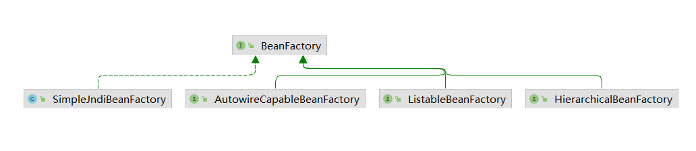
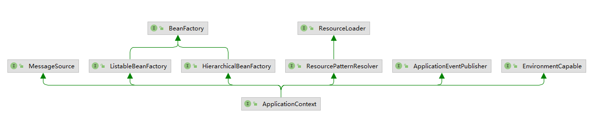
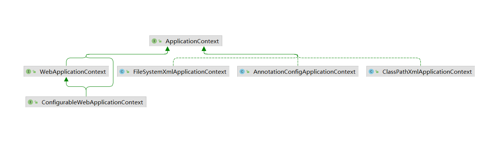

### 1. BeanFactory



### 2. ApplicationContext





1. ApplicationEventPublisher：让容器拥有发布上下文事件的功能(容器启动，关闭等)

   ​ AbstractApplicationContext中存在一个ApplicationEventMulticaster保存所有的监听器

2. MessageSource: 提供国际化消息访问功能

3. ResourcePatternResolver: 通过带前缀的Ant风格的资源文件路径装载spring配置文件

4. LiftStyle: 通过start, stop两个方法控制异步处理过程

实现类：

1. FileSystemXmlApplicationContext

2. ClassPathXmlApplicationContext

3. AnnotationConfigApplicationContext

4. WebApplicationContext

   为Web应用准备的，可以从根目录装载配置文件完成初始化。可以从中获取ServletContext(整个web应用上下文对象将作为属性放到其中，便于web应用可以访问spring上下文)

   ```java
   // 互相获取
   WebApplicationContext wac = (WebApplicationContext)servletContext.getAttribute(WebApplicationContext.ROOT_WEB_APPLICATION_CONTEXT_ATTRIBUTE);
   
   ServletContext sc = wac.getServletContext();
   ```

   为bean添加了三个作用域: singleton, prototype, request, session, global session

   ​ ConfigurableWebApplicationContext继承该接口

   初始化方式：

    1. org.springframework.web.context.ContextLoaderServlet

       ​ 配置<listener>

    2. org.springframework.web.context.ContextLoaderListener

       ​ 配置<servlet>


